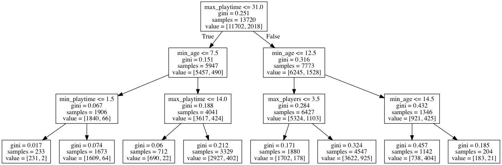

{:.input_area}
```python
%matplotlib inline

import pandas as pd

pd.set_option('display.max_colwidth', 120)
```


{:.input_area}
```python
# 2. Fit the data

vectorizer.fit(wine_df['description'])

```


{:.output .output_data_text}
```
CountVectorizer(analyzer='word', binary=False, decode_error='strict',
        dtype=<class 'numpy.int64'>, encoding='utf-8', input='content',
        lowercase=True, max_df=0.5, max_features=None, min_df=0.01,
        ngram_range=(1, 1), preprocessor=None, stop_words='english',
        strip_accents=None, token_pattern='(?u)\\b\\w\\w+\\b',
        tokenizer=None, vocabulary=None)
```


{:.input_area}
```python
len(vectorizer.get_feature_names())
```


{:.output .output_data_text}
```
409
```


{:.input_area}
```python
# 3. Transform based on the model
review_word_counts = vectorizer.transform(wine_df['description'])
```


{:.input_area}
```python
from sklearn.neighbors import KNeighborsClassifier

# 1. Set the parameters
knn_classifier = KNeighborsClassifier(n_neighbors = 3)
```


{:.input_area}
```python
# 2. Fit the data
knn_classifier.fit(review_word_counts, wine_df['rating'])

```


{:.output .output_data_text}
```
KNeighborsClassifier(algorithm='auto', leaf_size=30, metric='minkowski',
           metric_params=None, n_jobs=1, n_neighbors=3, p=2,
           weights='uniform')
```


{:.input_area}
```python
# 3. Transform based on the model

knn_prediction = knn_classifier.predict(review_word_counts)
```


{:.input_area}
```python

print(classification_report(wine_df['rating'], knn_prediction))


```


{:.output .output_stream}
```
             precision    recall  f1-score   support

       High       0.98      0.33      0.50      3880
        Low       0.70      1.00      0.82      6120

avg / total       0.81      0.74      0.70     10000


```

<div class="alert alert-info">
<h3> Your turn</h3>
<p> What is the f1 score for the model?

</div>


What about fit on a different data?


{:.input_area}
```python
wine_df_test = wine_df_full.sample(n = 10000)
```


{:.input_area}
```python
# numbers into words
# don't rebuild the model, just predict.

wdt_tf = vectorizer.transform(wine_df_test['description'])
```


{:.input_area}
```python
# don't rebuild the model, just predict.

test_prediction = knn_classifier.predict(wdt_tf)
```


{:.input_area}
```python
print(classification_report(wine_df['rating'], test_prediction))


```


{:.output .output_stream}
```
             precision    recall  f1-score   support

       High       0.40      0.07      0.12      3880
        Low       0.61      0.93      0.74      6120

avg / total       0.53      0.60      0.50     10000


```


<div class="alert alert-info">
<h3> Your turn</h3>
<p> What about changing your model to 6 neighbors? Does it fit better? Do you have the same results as other members of your group?

</div>


{:.input_area}
```python
for n in [2, 4, 6, 12]:
    print(n)
    knn_classifier = KNeighborsClassifier(n_neighbors = n)
    knn_classifier.fit(review_word_counts, wine_df['rating'])
    
    train_predict = knn_classifier.predict(review_word_counts)
    print(accuracy_score(wine_df['rating'], train_predict))
    
    test_predict = knn_classifier.predict(wdt_tf)
    print(accuracy_score(wine_df_test['rating'], test_predict))


```


{:.output .output_stream}
```
2
0.98
0.7381
4
0.7648
0.6853
6
0.7049
0.6616
12
0.6538
0.6343

```


{:.input_area}
```python
from sklearn.model_selection import GridSearchCV
```


{:.input_area}
```python
# old model: knn_classifier = KNeighborsClassifier(n_neighbors = 3)

parameters = {'n_neighbors' : [2,3, 7],
              'weights'      : ['distance', 'uniform']}
              
```


{:.input_area}
```python
grid = GridSearchCV(KNeighborsClassifier(), 
                    parameters, 
                    cv = 5)
```


{:.input_area}
```python
grid.fit(review_word_counts, wine_df['rating'])
```


{:.output .output_data_text}
```
GridSearchCV(cv=5, error_score='raise',
       estimator=KNeighborsClassifier(algorithm='auto', leaf_size=30, metric='minkowski',
           metric_params=None, n_jobs=1, n_neighbors=5, p=2,
           weights='uniform'),
       fit_params=None, iid=True, n_jobs=1,
       param_grid={'n_neighbors': [2, 3, 7], 'weights': ['distance', 'uniform']},
       pre_dispatch='2*n_jobs', refit=True, return_train_score='warn',
       scoring=None, verbose=0)
```


{:.input_area}
```python
grid.cv_results_
```


{:.output .output_data_text}
```
{'mean_fit_time': array([0.01243081, 0.01146436, 0.01231976, 0.01234374, 0.01134434,
        0.01248574]),
 'mean_score_time': array([0.6254056 , 0.57316837, 0.72712083, 0.66340117, 0.74647989,
        0.76884518]),
 'mean_test_score': array([0.6857, 0.7012, 0.6585, 0.6561, 0.6451, 0.6423]),
 'mean_train_score': array([1.      , 0.979925, 1.      , 0.734575, 1.      , 0.66275 ]),
 'param_n_neighbors': masked_array(data=[2, 2, 3, 3, 7, 7],
              mask=[False, False, False, False, False, False],
        fill_value='?',
             dtype=object),
 'param_weights': masked_array(data=['distance', 'uniform', 'distance', 'uniform',
                    'distance', 'uniform'],
              mask=[False, False, False, False, False, False],
        fill_value='?',
             dtype=object),
 'params': [{'n_neighbors': 2, 'weights': 'distance'},
  {'n_neighbors': 2, 'weights': 'uniform'},
  {'n_neighbors': 3, 'weights': 'distance'},
  {'n_neighbors': 3, 'weights': 'uniform'},
  {'n_neighbors': 7, 'weights': 'distance'},
  {'n_neighbors': 7, 'weights': 'uniform'}],
 'rank_test_score': array([2, 1, 3, 4, 5, 6], dtype=int32),
 'split0_test_score': array([0.6965, 0.706 , 0.656 , 0.654 , 0.645 , 0.6425]),
 'split0_train_score': array([1.   , 0.978, 1.   , 0.737, 1.   , 0.665]),
 'split1_test_score': array([0.677 , 0.6915, 0.658 , 0.655 , 0.6455, 0.642 ]),
 'split1_train_score': array([1.      , 0.98175 , 1.      , 0.733   , 1.      , 0.660875]),
 'split2_test_score': array([0.6865, 0.705 , 0.66  , 0.6595, 0.6425, 0.641 ]),
 'split2_train_score': array([1.      , 0.979375, 1.      , 0.73025 , 1.      , 0.659875]),
 'split3_test_score': array([0.6785, 0.694 , 0.658 , 0.6545, 0.6445, 0.641 ]),
 'split3_train_score': array([1.      , 0.979875, 1.      , 0.7395  , 1.      , 0.6685  ]),
 'split4_test_score': array([0.69  , 0.7095, 0.6605, 0.6575, 0.648 , 0.645 ]),
 'split4_train_score': array([1.      , 0.980625, 1.      , 0.733125, 1.      , 0.6595  ]),
 'std_fit_time': array([0.00050485, 0.00067581, 0.00036578, 0.00051288, 0.00045831,
        0.00051015]),
 'std_score_time': array([0.06634425, 0.01184952, 0.07229286, 0.05769311, 0.01632403,
        0.05215541]),
 'std_test_score': array([0.00725672, 0.00710352, 0.00161245, 0.00208327, 0.001772  ,
        0.00146969]),
 'std_train_score': array([0.        , 0.0012515 , 0.        , 0.00326879, 0.        ,
        0.00347761])}
```


{:.input_area}
```python
pd.DataFrame(grid.cv_results_)
```


<div markdown="0" class="output output_html">
<div>
<style scoped>
    .dataframe tbody tr th:only-of-type {
        vertical-align: middle;
    }

    .dataframe tbody tr th {
        vertical-align: top;
    }

    .dataframe thead th {
        text-align: right;
    }
</style>
<table border="1" class="dataframe">
  <thead>
    <tr style="text-align: right;">
      <th></th>
      <th>mean_fit_time</th>
      <th>mean_score_time</th>
      <th>mean_test_score</th>
      <th>mean_train_score</th>
      <th>param_n_neighbors</th>
      <th>param_weights</th>
      <th>params</th>
      <th>rank_test_score</th>
      <th>split0_test_score</th>
      <th>split0_train_score</th>
      <th>...</th>
      <th>split2_test_score</th>
      <th>split2_train_score</th>
      <th>split3_test_score</th>
      <th>split3_train_score</th>
      <th>split4_test_score</th>
      <th>split4_train_score</th>
      <th>std_fit_time</th>
      <th>std_score_time</th>
      <th>std_test_score</th>
      <th>std_train_score</th>
    </tr>
  </thead>
  <tbody>
    <tr>
      <th>0</th>
      <td>0.012431</td>
      <td>0.625406</td>
      <td>0.6857</td>
      <td>1.000000</td>
      <td>2</td>
      <td>distance</td>
      <td>{'n_neighbors': 2, 'weights': 'distance'}</td>
      <td>2</td>
      <td>0.6965</td>
      <td>1.000</td>
      <td>...</td>
      <td>0.6865</td>
      <td>1.000000</td>
      <td>0.6785</td>
      <td>1.000000</td>
      <td>0.6900</td>
      <td>1.000000</td>
      <td>0.000505</td>
      <td>0.066344</td>
      <td>0.007257</td>
      <td>0.000000</td>
    </tr>
    <tr>
      <th>1</th>
      <td>0.011464</td>
      <td>0.573168</td>
      <td>0.7012</td>
      <td>0.979925</td>
      <td>2</td>
      <td>uniform</td>
      <td>{'n_neighbors': 2, 'weights': 'uniform'}</td>
      <td>1</td>
      <td>0.7060</td>
      <td>0.978</td>
      <td>...</td>
      <td>0.7050</td>
      <td>0.979375</td>
      <td>0.6940</td>
      <td>0.979875</td>
      <td>0.7095</td>
      <td>0.980625</td>
      <td>0.000676</td>
      <td>0.011850</td>
      <td>0.007104</td>
      <td>0.001251</td>
    </tr>
    <tr>
      <th>2</th>
      <td>0.012320</td>
      <td>0.727121</td>
      <td>0.6585</td>
      <td>1.000000</td>
      <td>3</td>
      <td>distance</td>
      <td>{'n_neighbors': 3, 'weights': 'distance'}</td>
      <td>3</td>
      <td>0.6560</td>
      <td>1.000</td>
      <td>...</td>
      <td>0.6600</td>
      <td>1.000000</td>
      <td>0.6580</td>
      <td>1.000000</td>
      <td>0.6605</td>
      <td>1.000000</td>
      <td>0.000366</td>
      <td>0.072293</td>
      <td>0.001612</td>
      <td>0.000000</td>
    </tr>
    <tr>
      <th>3</th>
      <td>0.012344</td>
      <td>0.663401</td>
      <td>0.6561</td>
      <td>0.734575</td>
      <td>3</td>
      <td>uniform</td>
      <td>{'n_neighbors': 3, 'weights': 'uniform'}</td>
      <td>4</td>
      <td>0.6540</td>
      <td>0.737</td>
      <td>...</td>
      <td>0.6595</td>
      <td>0.730250</td>
      <td>0.6545</td>
      <td>0.739500</td>
      <td>0.6575</td>
      <td>0.733125</td>
      <td>0.000513</td>
      <td>0.057693</td>
      <td>0.002083</td>
      <td>0.003269</td>
    </tr>
    <tr>
      <th>4</th>
      <td>0.011344</td>
      <td>0.746480</td>
      <td>0.6451</td>
      <td>1.000000</td>
      <td>7</td>
      <td>distance</td>
      <td>{'n_neighbors': 7, 'weights': 'distance'}</td>
      <td>5</td>
      <td>0.6450</td>
      <td>1.000</td>
      <td>...</td>
      <td>0.6425</td>
      <td>1.000000</td>
      <td>0.6445</td>
      <td>1.000000</td>
      <td>0.6480</td>
      <td>1.000000</td>
      <td>0.000458</td>
      <td>0.016324</td>
      <td>0.001772</td>
      <td>0.000000</td>
    </tr>
    <tr>
      <th>5</th>
      <td>0.012486</td>
      <td>0.768845</td>
      <td>0.6423</td>
      <td>0.662750</td>
      <td>7</td>
      <td>uniform</td>
      <td>{'n_neighbors': 7, 'weights': 'uniform'}</td>
      <td>6</td>
      <td>0.6425</td>
      <td>0.665</td>
      <td>...</td>
      <td>0.6410</td>
      <td>0.659875</td>
      <td>0.6410</td>
      <td>0.668500</td>
      <td>0.6450</td>
      <td>0.659500</td>
      <td>0.000510</td>
      <td>0.052155</td>
      <td>0.001470</td>
      <td>0.003478</td>
    </tr>
  </tbody>
</table>
<p>6 rows × 22 columns</p>
</div>
</div>


{:.input_area}
```python
grid.best_estimator_
```


{:.output .output_data_text}
```
KNeighborsClassifier(algorithm='auto', leaf_size=30, metric='minkowski',
           metric_params=None, n_jobs=1, n_neighbors=2, p=2,
           weights='uniform')
```


{:.input_area}
```python
train_prediction = grid.best_estimator_.predict(review_word_counts)

print(accuracy_score(wine_df['rating'], train_prediction))
```


{:.output .output_stream}
```
0.98

```


{:.input_area}
```python
knn_best_estimator = grid.best_estimator_

test_prediction  = knn_best_estimator.predict(wdt_tf)


print(classification_report(wine_df_test['rating'], test_prediction))
```


{:.output .output_stream}
```
             precision    recall  f1-score   support

       High       0.84      0.42      0.56      3956
        Low       0.71      0.95      0.81      6044

avg / total       0.76      0.74      0.71     10000


```

<div class="alert alert-info">
<h3> Your turn</h3>
<p> What is the optimal settings for k-nearest neighbor model?
</div>


{:.input_area}
```python
from sklearn.pipeline import Pipeline
from sklearn.model_selection import GridSearchCV

pipeline = Pipeline([
                     ('vectorizer' , CountVectorizer()),
                     ('classifier' , KNeighborsClassifier())
                    ])

parameters = {'vectorizer__max_features' : [300, 500, 700],
              'classifier__n_neighbors' : [2,3, 5] }


```


{:.input_area}
```python
grid        = GridSearchCV(pipeline,
                           parameters,
                           n_jobs = -1,
                           cv = 3,
                           return_train_score = True,
                           verbose = 1)
```


{:.input_area}
```python
grid.fit(wine_df['description'], wine_df['rating'])
```


{:.output .output_stream}
```
Fitting 3 folds for each of 9 candidates, totalling 27 fits

```


{:.output .output_data_text}
```
GridSearchCV(cv=3, error_score='raise',
       estimator=Pipeline(memory=None,
     steps=[('vectorizer', CountVectorizer(analyzer='word', binary=False, decode_error='strict',
        dtype=<class 'numpy.int64'>, encoding='utf-8', input='content',
        lowercase=True, max_df=1.0, max_features=None, min_df=1,
        ngram_range=(1, 1), preprocessor=None, stop_words=None,
       ...owski',
           metric_params=None, n_jobs=1, n_neighbors=5, p=2,
           weights='uniform'))]),
       fit_params=None, iid=True, n_jobs=-1,
       param_grid={'vectorizer__max_features': [300, 500, 700], 'classifier__n_neighbors': [2, 3, 5]},
       pre_dispatch='2*n_jobs', refit=True, return_train_score=True,
       scoring=None, verbose=1)
```


<div class="alert alert-info">
<h3> Your turn</h3>
<p> How does this compare to a logistic regression model?
<code> google sklearn logistic regression </code>
</div>


{:.input_area}
```python
pd.DataFrame(grid.cv_results_)
```


<div markdown="0" class="output output_html">
<div>
<style scoped>
    .dataframe tbody tr th:only-of-type {
        vertical-align: middle;
    }

    .dataframe tbody tr th {
        vertical-align: top;
    }

    .dataframe thead th {
        text-align: right;
    }
</style>
<table border="1" class="dataframe">
  <thead>
    <tr style="text-align: right;">
      <th></th>
      <th>mean_fit_time</th>
      <th>mean_score_time</th>
      <th>mean_test_score</th>
      <th>mean_train_score</th>
      <th>param_classifier__n_neighbors</th>
      <th>param_vectorizer__max_features</th>
      <th>params</th>
      <th>rank_test_score</th>
      <th>split0_test_score</th>
      <th>split0_train_score</th>
      <th>split1_test_score</th>
      <th>split1_train_score</th>
      <th>split2_test_score</th>
      <th>split2_train_score</th>
      <th>std_fit_time</th>
      <th>std_score_time</th>
      <th>std_test_score</th>
      <th>std_train_score</th>
    </tr>
  </thead>
  <tbody>
    <tr>
      <th>0</th>
      <td>0.598258</td>
      <td>2.685512</td>
      <td>0.7243</td>
      <td>0.952250</td>
      <td>2</td>
      <td>300</td>
      <td>{'classifier__n_neighbors': 2, 'vectorizer__max_features': 300}</td>
      <td>1</td>
      <td>0.724355</td>
      <td>0.949895</td>
      <td>0.726673</td>
      <td>0.954402</td>
      <td>0.721872</td>
      <td>0.952452</td>
      <td>0.003394</td>
      <td>0.018643</td>
      <td>0.001960</td>
      <td>0.001846</td>
    </tr>
    <tr>
      <th>1</th>
      <td>0.582437</td>
      <td>2.546346</td>
      <td>0.7215</td>
      <td>0.965650</td>
      <td>2</td>
      <td>500</td>
      <td>{'classifier__n_neighbors': 2, 'vectorizer__max_features': 500}</td>
      <td>3</td>
      <td>0.727355</td>
      <td>0.959646</td>
      <td>0.727573</td>
      <td>0.968052</td>
      <td>0.709571</td>
      <td>0.969252</td>
      <td>0.013307</td>
      <td>0.115461</td>
      <td>0.008435</td>
      <td>0.004273</td>
    </tr>
    <tr>
      <th>2</th>
      <td>0.610783</td>
      <td>2.521556</td>
      <td>0.7236</td>
      <td>0.969000</td>
      <td>2</td>
      <td>700</td>
      <td>{'classifier__n_neighbors': 2, 'vectorizer__max_features': 700}</td>
      <td>2</td>
      <td>0.728554</td>
      <td>0.963546</td>
      <td>0.727573</td>
      <td>0.969402</td>
      <td>0.714671</td>
      <td>0.974051</td>
      <td>0.025366</td>
      <td>0.010965</td>
      <td>0.006326</td>
      <td>0.004298</td>
    </tr>
    <tr>
      <th>3</th>
      <td>0.609263</td>
      <td>2.527058</td>
      <td>0.6987</td>
      <td>0.803550</td>
      <td>3</td>
      <td>300</td>
      <td>{'classifier__n_neighbors': 3, 'vectorizer__max_features': 300}</td>
      <td>4</td>
      <td>0.705459</td>
      <td>0.805281</td>
      <td>0.700270</td>
      <td>0.800060</td>
      <td>0.690369</td>
      <td>0.805310</td>
      <td>0.011740</td>
      <td>0.004321</td>
      <td>0.006260</td>
      <td>0.002468</td>
    </tr>
    <tr>
      <th>4</th>
      <td>0.632821</td>
      <td>2.604387</td>
      <td>0.6847</td>
      <td>0.782850</td>
      <td>3</td>
      <td>500</td>
      <td>{'classifier__n_neighbors': 3, 'vectorizer__max_features': 500}</td>
      <td>6</td>
      <td>0.691662</td>
      <td>0.787579</td>
      <td>0.684668</td>
      <td>0.781911</td>
      <td>0.677768</td>
      <td>0.779061</td>
      <td>0.007089</td>
      <td>0.036815</td>
      <td>0.005672</td>
      <td>0.003540</td>
    </tr>
    <tr>
      <th>5</th>
      <td>0.777215</td>
      <td>2.901209</td>
      <td>0.6807</td>
      <td>0.778551</td>
      <td>3</td>
      <td>700</td>
      <td>{'classifier__n_neighbors': 3, 'vectorizer__max_features': 700}</td>
      <td>7</td>
      <td>0.686563</td>
      <td>0.789379</td>
      <td>0.680168</td>
      <td>0.775461</td>
      <td>0.675368</td>
      <td>0.770811</td>
      <td>0.160461</td>
      <td>0.205566</td>
      <td>0.004586</td>
      <td>0.007889</td>
    </tr>
    <tr>
      <th>6</th>
      <td>0.906246</td>
      <td>3.479473</td>
      <td>0.6947</td>
      <td>0.756500</td>
      <td>5</td>
      <td>300</td>
      <td>{'classifier__n_neighbors': 5, 'vectorizer__max_features': 300}</td>
      <td>5</td>
      <td>0.700960</td>
      <td>0.757726</td>
      <td>0.693669</td>
      <td>0.750112</td>
      <td>0.689469</td>
      <td>0.761662</td>
      <td>0.133283</td>
      <td>0.092705</td>
      <td>0.004748</td>
      <td>0.004794</td>
    </tr>
    <tr>
      <th>7</th>
      <td>0.759941</td>
      <td>3.473811</td>
      <td>0.6774</td>
      <td>0.736050</td>
      <td>5</td>
      <td>500</td>
      <td>{'classifier__n_neighbors': 5, 'vectorizer__max_features': 500}</td>
      <td>8</td>
      <td>0.687163</td>
      <td>0.744224</td>
      <td>0.678068</td>
      <td>0.732413</td>
      <td>0.666967</td>
      <td>0.731513</td>
      <td>0.042536</td>
      <td>0.118061</td>
      <td>0.008259</td>
      <td>0.005792</td>
    </tr>
    <tr>
      <th>8</th>
      <td>0.699978</td>
      <td>2.871981</td>
      <td>0.6760</td>
      <td>0.726950</td>
      <td>5</td>
      <td>700</td>
      <td>{'classifier__n_neighbors': 5, 'vectorizer__max_features': 700}</td>
      <td>9</td>
      <td>0.682364</td>
      <td>0.736124</td>
      <td>0.675368</td>
      <td>0.719064</td>
      <td>0.670267</td>
      <td>0.725664</td>
      <td>0.017384</td>
      <td>0.161824</td>
      <td>0.004959</td>
      <td>0.007024</td>
    </tr>
  </tbody>
</table>
</div>
</div>


And now for something different

<div class="alert alert-info">
<h3> Your turn</h3>
<p> As a group, take a look at the text of the wine descriptions. Ignore the ratings. What different themes do you find?
</div>


{:.input_area}
```python
wine_df['description'].values[250]
```


{:.output .output_data_text}
```
"There's a strong peach-fuzz aroma enveloping this wine. It's unoaked, tasting overly rich and oily."
```


{:.input_area}
```python
from sklearn.decomposition import LatentDirichletAllocation


```


{:.input_area}
```python
vectorizer = CountVectorizer(lowercase   = True,
                             ngram_range = (1,2),
                             max_df      = .50,
                             min_df      = .01,
                             max_features = None)
```


{:.input_area}
```python
vectorizer.fit(wine_df['description'])
```


{:.output .output_data_text}
```
CountVectorizer(analyzer='word', binary=False, decode_error='strict',
        dtype=<class 'numpy.int64'>, encoding='utf-8', input='content',
        lowercase=True, max_df=0.5, max_features=None, min_df=0.01,
        ngram_range=(1, 2), preprocessor=None, stop_words=None,
        strip_accents=None, token_pattern='(?u)\\b\\w\\w+\\b',
        tokenizer=None, vocabulary=None)
```


{:.input_area}
```python
review_word_counts = vectorizer.transform(wine_df['description'])
```


{:.input_area}
```python
lda = LatentDirichletAllocation(n_components   = 5)

lda.fit(review_word_counts)
```


{:.output .output_data_text}
```
LatentDirichletAllocation(batch_size=128, doc_topic_prior=None,
             evaluate_every=-1, learning_decay=0.7, learning_method=None,
             learning_offset=10.0, max_doc_update_iter=100, max_iter=10,
             mean_change_tol=0.001, n_components=5, n_jobs=1,
             n_topics=None, perp_tol=0.1, random_state=None,
             topic_word_prior=None, total_samples=1000000.0, verbose=0)
```


{:.input_area}
```python
lda.fit(review_word_counts)
```


{:.output .output_data_text}
```
LatentDirichletAllocation(batch_size=128, doc_topic_prior=None,
             evaluate_every=-1, learning_decay=0.7, learning_method=None,
             learning_offset=10.0, max_doc_update_iter=100, max_iter=10,
             mean_change_tol=0.001, n_components=5, n_jobs=1,
             n_topics=None, perp_tol=0.1, random_state=None,
             topic_word_prior=None, total_samples=1000000.0, verbose=0)
```


What words are associated with what topics?

LatentDirichletAllocation is bad a showing results in a pretty way.


{:.input_area}
```python
def column_swap(column):
    column = column.sort_values(ascending = False)
    return column.index

def topic_words_df(lda_model, vectorizer):
    '''
    Generate dataframe of words associated with a topic model.
    '''
    
    word_topic_scores = lda_model.components_.T
    vocabulary        = vectorizer.get_feature_names()
    
    
    topic_words_df = pd.DataFrame(word_topic_scores,
                                  index = vocabulary)
    
    topic_words_df = topic_words_df.apply(column_swap).reset_index(drop = True).rename_axis('rank')
    
    topic_words_df.index = topic_words_df.index + 1
    
    return topic_words_df
```


{:.input_area}
```python
topic_words_df(lda, vectorizer).head(10)
```


<div markdown="0" class="output output_html">
<div>
<style scoped>
    .dataframe tbody tr th:only-of-type {
        vertical-align: middle;
    }

    .dataframe tbody tr th {
        vertical-align: top;
    }

    .dataframe thead th {
        text-align: right;
    }
</style>
<table border="1" class="dataframe">
  <thead>
    <tr style="text-align: right;">
      <th></th>
      <th>0</th>
      <th>1</th>
      <th>2</th>
      <th>3</th>
      <th>4</th>
    </tr>
    <tr>
      <th>rank</th>
      <th></th>
      <th></th>
      <th></th>
      <th></th>
      <th></th>
    </tr>
  </thead>
  <tbody>
    <tr>
      <th>1</th>
      <td>flavors</td>
      <td>wine</td>
      <td>flavors</td>
      <td>aromas</td>
      <td>in</td>
    </tr>
    <tr>
      <th>2</th>
      <td>on</td>
      <td>to</td>
      <td>in</td>
      <td>palate</td>
      <td>on</td>
    </tr>
    <tr>
      <th>3</th>
      <td>palate</td>
      <td>drink</td>
      <td>wine</td>
      <td>finish</td>
      <td>black</td>
    </tr>
    <tr>
      <th>4</th>
      <td>apple</td>
      <td>that</td>
      <td>blend</td>
      <td>on</td>
      <td>oak</td>
    </tr>
    <tr>
      <th>5</th>
      <td>on the</td>
      <td>from</td>
      <td>cabernet</td>
      <td>flavors</td>
      <td>flavors</td>
    </tr>
    <tr>
      <th>6</th>
      <td>citrus</td>
      <td>ripe</td>
      <td>red</td>
      <td>aromas of</td>
      <td>to</td>
    </tr>
    <tr>
      <th>7</th>
      <td>acidity</td>
      <td>acidity</td>
      <td>soft</td>
      <td>cherry</td>
      <td>chocolate</td>
    </tr>
    <tr>
      <th>8</th>
      <td>finish</td>
      <td>fruit</td>
      <td>fruit</td>
      <td>berry</td>
      <td>wine</td>
    </tr>
    <tr>
      <th>9</th>
      <td>to</td>
      <td>has</td>
      <td>that</td>
      <td>fruit</td>
      <td>in the</td>
    </tr>
    <tr>
      <th>10</th>
      <td>wine</td>
      <td>tannins</td>
      <td>blend of</td>
      <td>on the</td>
      <td>on the</td>
    </tr>
  </tbody>
</table>
</div>
</div>


<div class="alert alert-info">
<h3> Your turn</h3>
<p> As a group, try different options for your vectorizer and number of topics. What set of parameters creates the most coherent topics?

</div>


<div class="alert alert-info">
<h3> Your turn</h3>
<p> What were the major themes in Donald Trump campaign speeches?
</div>


{:.input_area}
```python
ge_df = pd.read_json('data/ge_speeches.json')
```


{:.input_area}
```python
vectorizer = CountVectorizer(lowercase   = True,
                             ngram_range = (1,1),
                             stop_words  = ['lot', 'percent'],
                             max_df      = .60,
                             min_df      = .01,
                             max_features = None)

vectorizer.fit(ge_df['text'])
```


{:.output .output_data_text}
```
CountVectorizer(analyzer='word', binary=False, decode_error='strict',
        dtype=<class 'numpy.int64'>, encoding='utf-8', input='content',
        lowercase=True, max_df=0.6, max_features=None, min_df=0.01,
        ngram_range=(1, 1), preprocessor=None,
        stop_words=['lot', 'percent'], strip_accents=None,
        token_pattern='(?u)\\b\\w\\w+\\b', tokenizer=None, vocabulary=None)
```


{:.input_area}
```python
ge_tf = vectorizer.transform(ge_df['text'])
```


{:.input_area}
```python
lda = LatentDirichletAllocation(n_components   = 10)

lda.fit(ge_tf)

topic_words_df(lda, vectorizer).head(10)
```


<div markdown="0" class="output output_html">
<div>
<style scoped>
    .dataframe tbody tr th:only-of-type {
        vertical-align: middle;
    }

    .dataframe tbody tr th {
        vertical-align: top;
    }

    .dataframe thead th {
        text-align: right;
    }
</style>
<table border="1" class="dataframe">
  <thead>
    <tr style="text-align: right;">
      <th></th>
      <th>0</th>
      <th>1</th>
      <th>2</th>
      <th>3</th>
      <th>4</th>
      <th>5</th>
      <th>6</th>
      <th>7</th>
      <th>8</th>
      <th>9</th>
    </tr>
    <tr>
      <th>rank</th>
      <th></th>
      <th></th>
      <th></th>
      <th></th>
      <th></th>
      <th></th>
      <th></th>
      <th></th>
      <th></th>
      <th></th>
    </tr>
  </thead>
  <tbody>
    <tr>
      <th>1</th>
      <td>illegal</td>
      <td>him</td>
      <td>cyber</td>
      <td>kids</td>
      <td>isis</td>
      <td>citizens</td>
      <td>growth</td>
      <td>cities</td>
      <td>folks</td>
      <td>folks</td>
    </tr>
    <tr>
      <th>2</th>
      <td>immigration</td>
      <td>kids</td>
      <td>review</td>
      <td>him</td>
      <td>terrorism</td>
      <td>administration</td>
      <td>trillion</td>
      <td>regulations</td>
      <td>doesn</td>
      <td>bad</td>
    </tr>
    <tr>
      <th>3</th>
      <td>administration</td>
      <td>friends</td>
      <td>attacks</td>
      <td>everybody</td>
      <td>radical</td>
      <td>illegal</td>
      <td>income</td>
      <td>follow</td>
      <td>bad</td>
      <td>isis</td>
    </tr>
    <tr>
      <th>4</th>
      <td>obamacare</td>
      <td>each</td>
      <td>justice</td>
      <td>kind</td>
      <td>islamic</td>
      <td>immigration</td>
      <td>childcare</td>
      <td>donors</td>
      <td>cities</td>
      <td>doesn</td>
    </tr>
    <tr>
      <th>5</th>
      <td>folks</td>
      <td>gwen</td>
      <td>department</td>
      <td>something</td>
      <td>defense</td>
      <td>high</td>
      <td>regulations</td>
      <td>policies</td>
      <td>everybody</td>
      <td>pennsylvania</td>
    </tr>
    <tr>
      <th>6</th>
      <td>mexico</td>
      <td>black</td>
      <td>defense</td>
      <td>college</td>
      <td>east</td>
      <td>failed</td>
      <td>savings</td>
      <td>rebuild</td>
      <td>isis</td>
      <td>illegal</td>
    </tr>
    <tr>
      <th>7</th>
      <td>border</td>
      <td>doesn</td>
      <td>best</td>
      <td>each</td>
      <td>iraq</td>
      <td>10</td>
      <td>wealth</td>
      <td>policy</td>
      <td>failed</td>
      <td>ago</td>
    </tr>
    <tr>
      <th>8</th>
      <td>cities</td>
      <td>joyce</td>
      <td>both</td>
      <td>friends</td>
      <td>war</td>
      <td>kids</td>
      <td>china</td>
      <td>citizens</td>
      <td>didn</td>
      <td>ok</td>
    </tr>
    <tr>
      <th>9</th>
      <td>companies</td>
      <td>kind</td>
      <td>enforcement</td>
      <td>still</td>
      <td>policy</td>
      <td>best</td>
      <td>cost</td>
      <td>interests</td>
      <td>thing</td>
      <td>story</td>
    </tr>
    <tr>
      <th>10</th>
      <td>borders</td>
      <td>marian</td>
      <td>crime</td>
      <td>doesn</td>
      <td>immigration</td>
      <td>everybody</td>
      <td>rate</td>
      <td>deals</td>
      <td>companies</td>
      <td>companies</td>
    </tr>
  </tbody>
</table>
</div>
</div>


What documents are associated with what topics?


{:.input_area}
```python
wine_topics = lda.transform(review_word_counts)
```


{:.input_area}
```python
wine_topics
```


{:.output .output_data_text}
```
array([[0.01820025, 0.29652361, 0.11186351, 0.33473465, 0.23867797],
       [0.0250004 , 0.02517967, 0.02500055, 0.02527369, 0.89954568],
       [0.05000828, 0.05000008, 0.05000007, 0.79967762, 0.05031396],
       ...,
       [0.39021072, 0.03333402, 0.03333387, 0.0339383 , 0.5091831 ],
       [0.05073342, 0.05000071, 0.05046833, 0.79774203, 0.05105551],
       [0.04055079, 0.04000018, 0.04000014, 0.83770459, 0.0417443 ]])
```


{:.input_area}
```python
pd.DataFrame(wine_topics).head(10)
```


<div markdown="0" class="output output_html">
<div>
<style scoped>
    .dataframe tbody tr th:only-of-type {
        vertical-align: middle;
    }

    .dataframe tbody tr th {
        vertical-align: top;
    }

    .dataframe thead th {
        text-align: right;
    }
</style>
<table border="1" class="dataframe">
  <thead>
    <tr style="text-align: right;">
      <th></th>
      <th>0</th>
      <th>1</th>
      <th>2</th>
      <th>3</th>
      <th>4</th>
    </tr>
  </thead>
  <tbody>
    <tr>
      <th>0</th>
      <td>0.018200</td>
      <td>0.296524</td>
      <td>0.111864</td>
      <td>0.334735</td>
      <td>0.238678</td>
    </tr>
    <tr>
      <th>1</th>
      <td>0.025000</td>
      <td>0.025180</td>
      <td>0.025001</td>
      <td>0.025274</td>
      <td>0.899546</td>
    </tr>
    <tr>
      <th>2</th>
      <td>0.050008</td>
      <td>0.050000</td>
      <td>0.050000</td>
      <td>0.799678</td>
      <td>0.050314</td>
    </tr>
    <tr>
      <th>3</th>
      <td>0.259258</td>
      <td>0.020000</td>
      <td>0.020168</td>
      <td>0.680060</td>
      <td>0.020514</td>
    </tr>
    <tr>
      <th>4</th>
      <td>0.022322</td>
      <td>0.133351</td>
      <td>0.022223</td>
      <td>0.022982</td>
      <td>0.799122</td>
    </tr>
    <tr>
      <th>5</th>
      <td>0.082002</td>
      <td>0.012501</td>
      <td>0.012516</td>
      <td>0.012655</td>
      <td>0.880326</td>
    </tr>
    <tr>
      <th>6</th>
      <td>0.016780</td>
      <td>0.016670</td>
      <td>0.016672</td>
      <td>0.016750</td>
      <td>0.933127</td>
    </tr>
    <tr>
      <th>7</th>
      <td>0.484423</td>
      <td>0.025001</td>
      <td>0.149840</td>
      <td>0.315591</td>
      <td>0.025144</td>
    </tr>
    <tr>
      <th>8</th>
      <td>0.113505</td>
      <td>0.346898</td>
      <td>0.012549</td>
      <td>0.212557</td>
      <td>0.314491</td>
    </tr>
    <tr>
      <th>9</th>
      <td>0.015924</td>
      <td>0.015392</td>
      <td>0.015385</td>
      <td>0.937815</td>
      <td>0.015484</td>
    </tr>
  </tbody>
</table>
</div>
</div>


We can now use our topics as features


{:.input_area}
```python
knn_classifier = KNeighborsClassifier(n_neighbors = 3, weights = 'distance')

knn_classifier.fit(wine_topics, wine_df['rating'])
```


{:.output .output_data_text}
```
KNeighborsClassifier(algorithm='auto', leaf_size=30, metric='minkowski',
           metric_params=None, n_jobs=1, n_neighbors=3, p=2,
           weights='distance')
```


{:.input_area}
```python
train_prediction = knn_classifier.predict(wine_topics)
```


{:.input_area}
```python
print(accuracy_score(wine_df['rating'], train_prediction))


```


{:.output .output_stream}
```
1.0

```


{:.input_area}
```python
test_tf     = vectorizer.transform(wine_df_test['description'])
test_topics = lda.transform(test_tf)
test_prediction = knn_classifier.predict(test_topics)
```


{:.input_area}
```python
print(classification_report(wine_df_test['rating'], test_prediction))

```


{:.output .output_stream}
```
             precision    recall  f1-score   support

       High       0.64      0.59      0.61      3956
        Low       0.74      0.78      0.76      6044

avg / total       0.70      0.71      0.70     10000


```

<div class="alert alert-info">
<h3> Your turn</h3>
<p> Using your best topic model, what is the prediction rate for your best k nearest neighbors model?

</div>


Let's do it again, but with a different data set


{:.input_area}
```python
bg_df = pd.read_csv('data/boardgames.csv')
```


{:.input_area}
```python
bg_df.info()
```


{:.output .output_stream}
```
<class 'pandas.core.frame.DataFrame'>
RangeIndex: 13720 entries, 0 to 13719
Data columns (total 58 columns):
Unnamed: 0                              13720 non-null int64
index                                   13720 non-null int64
name                                    13720 non-null object
description                             13720 non-null object
max_players                             13720 non-null float64
min_players                             13720 non-null float64
min_playtime                            13720 non-null float64
max_playtime                            13720 non-null float64
min_age                                 13720 non-null float64
category                                13720 non-null object
mechanics                               13720 non-null object
year_published                          13720 non-null float64
weighted_score                          13720 non-null float64
number_of_comments                      13720 non-null float64
complexity                              13720 non-null float64
number_owned                            13720 non-null float64
number_raters                           13720 non-null float64
category_cardgame                       13720 non-null bool
category_wargame                        13720 non-null bool
category_fantasy                        13720 non-null bool
category_dice                           13720 non-null bool
category_partygame                      13720 non-null bool
category_fighting                       13720 non-null bool
category_sciencefiction                 13720 non-null bool
category_abstractstrategy               13720 non-null bool
category_economic                       13720 non-null bool
category_childrensgame                  13720 non-null bool
category_worldwarii                     13720 non-null bool
category_bluffing                       13720 non-null bool
category_animals                        13720 non-null bool
category_humor                          13720 non-null bool
category_actiondexterity                13720 non-null bool
category_adventure                      13720 non-null bool
category_moviestvradiotheme             13720 non-null bool
category_medieval                       13720 non-null bool
category_deduction                      13720 non-null bool
category_miniatures                     13720 non-null bool
mechanic_dicerolling                    13720 non-null bool
mechanic_handmanagement                 13720 non-null bool
mechanic_hexandcounter                  13720 non-null bool
mechanic_setcollection                  13720 non-null bool
mechanic_variableplayerpowers           13720 non-null bool
mechanic_none                           13720 non-null bool
mechanic_tileplacement                  13720 non-null bool
mechanic_modularboard                   13720 non-null bool
mechanic_carddrafting                   13720 non-null bool
mechanic_rollspinandmove                13720 non-null bool
mechanic_areacontrolareainfluence       13720 non-null bool
mechanic_auctionbidding                 13720 non-null bool
mechanic_simulation                     13720 non-null bool
mechanic_areamovement                   13720 non-null bool
mechanic_simultaneousactionselection    13720 non-null bool
mechanic_actionpointallowancesystem     13720 non-null bool
mechanic_cooperativeplay                13720 non-null bool
mechanic_pointtopointmovement           13720 non-null bool
mechanic_partnerships                   13720 non-null bool
mechanic_memory                         13720 non-null bool
quality_game                            13720 non-null bool
dtypes: bool(41), float64(11), int64(2), object(4)
memory usage: 2.3+ MB

```


{:.input_area}
```python
bg_df.head()
```


<div class="alert alert-info">
<h3> Your turn</h3>
<p> Load up this dataset in your other workbook. Topic model the game descriptions.

</div>


{:.input_area}
```python
from sklearn.feature_extraction.text import CountVectorizer

```


{:.input_area}
```python
vectorizer = CountVectorizer(max_df=.6,
                             min_df=.01,
                             stop_words= 'english')
```


{:.input_area}
```python
vectorizer.fit(bg_df['description'])
```


{:.output .output_data_text}
```
CountVectorizer(analyzer='word', binary=False, decode_error='strict',
        dtype=<class 'numpy.int64'>, encoding='utf-8', input='content',
        lowercase=True, max_df=0.6, max_features=None, min_df=0.01,
        ngram_range=(1, 1), preprocessor=None, stop_words='english',
        strip_accents=None, token_pattern='(?u)\\b\\w\\w+\\b',
        tokenizer=None, vocabulary=None)
```


{:.input_area}
```python
bg_wf = vectorizer.transform(bg_df['description'])
```


{:.input_area}
```python
pd.DataFrame(bg_wf.todense(), columns=vectorizer.get_feature_names()).sum().sort_values().tail()
```


{:.output .output_data_text}
```
points     6660
play       8171
card      11868
cards     18295
player    20632
dtype: int64
```


{:.input_area}
```python
len(vectorizer.get_feature_names())
```


{:.output .output_data_text}
```
1350
```


{:.input_area}
```python
from sklearn.decomposition import LatentDirichletAllocation
```


{:.input_area}
```python
lda = LatentDirichletAllocation(n_components   = 10,
                                n_jobs         = -1,
                               learning_method = 'online')
```


{:.input_area}
```python
lda.fit(bg_wf)
```


{:.output .output_data_text}
```
LatentDirichletAllocation(batch_size=128, doc_topic_prior=None,
             evaluate_every=-1, learning_decay=0.7,
             learning_method='online', learning_offset=10.0,
             max_doc_update_iter=100, max_iter=10, mean_change_tol=0.001,
             n_components=10, n_jobs=-1, n_topics=None, perp_tol=0.1,
             random_state=None, topic_word_prior=None,
             total_samples=1000000.0, verbose=0)
```


{:.input_area}
```python
topics = lda.transform(bg_wf)
```


{:.input_area}
```python
topics
```


{:.output .output_data_text}
```
array([[0.03679355, 0.00128221, 0.16932467, ..., 0.00128258, 0.23042156,
        0.21902049],
       [0.00166734, 0.04633801, 0.00166712, ..., 0.66111848, 0.00166688,
        0.00166742],
       [0.13538142, 0.00178592, 0.0017863 , ..., 0.2467892 , 0.00178637,
        0.00178612],
       ...,
       [0.00400069, 0.00400016, 0.13058438, ..., 0.00400077, 0.04660411,
        0.00400005],
       [0.00108719, 0.05541306, 0.06481335, ..., 0.00108721, 0.19867116,
        0.00108727],
       [0.20425653, 0.00175463, 0.38152976, ..., 0.00175504, 0.00175484,
        0.043443  ]])
```


{:.input_area}
```python
pd.DataFrame(topics)
```


<div markdown="0" class="output output_html">
<div>
<style scoped>
    .dataframe tbody tr th:only-of-type {
        vertical-align: middle;
    }

    .dataframe tbody tr th {
        vertical-align: top;
    }

    .dataframe thead th {
        text-align: right;
    }
</style>
<table border="1" class="dataframe">
  <thead>
    <tr style="text-align: right;">
      <th></th>
      <th>0</th>
      <th>1</th>
      <th>2</th>
      <th>3</th>
      <th>4</th>
      <th>5</th>
      <th>6</th>
      <th>7</th>
      <th>8</th>
      <th>9</th>
    </tr>
  </thead>
  <tbody>
    <tr>
      <th>0</th>
      <td>0.036794</td>
      <td>0.001282</td>
      <td>0.169325</td>
      <td>0.001282</td>
      <td>0.001282</td>
      <td>0.338028</td>
      <td>0.001282</td>
      <td>0.001283</td>
      <td>0.230422</td>
      <td>0.219020</td>
    </tr>
    <tr>
      <th>1</th>
      <td>0.001667</td>
      <td>0.046338</td>
      <td>0.001667</td>
      <td>0.184943</td>
      <td>0.001667</td>
      <td>0.097597</td>
      <td>0.001667</td>
      <td>0.661118</td>
      <td>0.001667</td>
      <td>0.001667</td>
    </tr>
    <tr>
      <th>2</th>
      <td>0.135381</td>
      <td>0.001786</td>
      <td>0.001786</td>
      <td>0.055077</td>
      <td>0.077460</td>
      <td>0.476361</td>
      <td>0.001786</td>
      <td>0.246789</td>
      <td>0.001786</td>
      <td>0.001786</td>
    </tr>
    <tr>
      <th>3</th>
      <td>0.416140</td>
      <td>0.003704</td>
      <td>0.003705</td>
      <td>0.003704</td>
      <td>0.003704</td>
      <td>0.274632</td>
      <td>0.003704</td>
      <td>0.003705</td>
      <td>0.066949</td>
      <td>0.220052</td>
    </tr>
    <tr>
      <th>4</th>
      <td>0.001924</td>
      <td>0.001923</td>
      <td>0.046196</td>
      <td>0.001923</td>
      <td>0.001923</td>
      <td>0.538005</td>
      <td>0.001923</td>
      <td>0.001923</td>
      <td>0.402336</td>
      <td>0.001923</td>
    </tr>
    <tr>
      <th>5</th>
      <td>0.069201</td>
      <td>0.003449</td>
      <td>0.251228</td>
      <td>0.003449</td>
      <td>0.003449</td>
      <td>0.273391</td>
      <td>0.003449</td>
      <td>0.003449</td>
      <td>0.121061</td>
      <td>0.267874</td>
    </tr>
    <tr>
      <th>6</th>
      <td>0.603030</td>
      <td>0.002381</td>
      <td>0.080042</td>
      <td>0.002381</td>
      <td>0.230618</td>
      <td>0.072023</td>
      <td>0.002381</td>
      <td>0.002381</td>
      <td>0.002381</td>
      <td>0.002381</td>
    </tr>
    <tr>
      <th>7</th>
      <td>0.003705</td>
      <td>0.003705</td>
      <td>0.399030</td>
      <td>0.065456</td>
      <td>0.003705</td>
      <td>0.509580</td>
      <td>0.003705</td>
      <td>0.003706</td>
      <td>0.003705</td>
      <td>0.003704</td>
    </tr>
    <tr>
      <th>8</th>
      <td>0.002000</td>
      <td>0.002000</td>
      <td>0.376853</td>
      <td>0.002000</td>
      <td>0.002001</td>
      <td>0.607145</td>
      <td>0.002000</td>
      <td>0.002000</td>
      <td>0.002000</td>
      <td>0.002000</td>
    </tr>
    <tr>
      <th>9</th>
      <td>0.163626</td>
      <td>0.000427</td>
      <td>0.027896</td>
      <td>0.000427</td>
      <td>0.000427</td>
      <td>0.368236</td>
      <td>0.051747</td>
      <td>0.386358</td>
      <td>0.000427</td>
      <td>0.000427</td>
    </tr>
    <tr>
      <th>10</th>
      <td>0.001786</td>
      <td>0.041278</td>
      <td>0.168536</td>
      <td>0.001786</td>
      <td>0.001786</td>
      <td>0.001786</td>
      <td>0.001786</td>
      <td>0.256963</td>
      <td>0.522507</td>
      <td>0.001786</td>
    </tr>
    <tr>
      <th>11</th>
      <td>0.001352</td>
      <td>0.001352</td>
      <td>0.161444</td>
      <td>0.001352</td>
      <td>0.001352</td>
      <td>0.802978</td>
      <td>0.026117</td>
      <td>0.001352</td>
      <td>0.001352</td>
      <td>0.001351</td>
    </tr>
    <tr>
      <th>12</th>
      <td>0.224039</td>
      <td>0.023161</td>
      <td>0.000568</td>
      <td>0.131756</td>
      <td>0.000568</td>
      <td>0.312246</td>
      <td>0.000568</td>
      <td>0.131744</td>
      <td>0.174781</td>
      <td>0.000568</td>
    </tr>
    <tr>
      <th>13</th>
      <td>0.231017</td>
      <td>0.001191</td>
      <td>0.001191</td>
      <td>0.001191</td>
      <td>0.023955</td>
      <td>0.594456</td>
      <td>0.001191</td>
      <td>0.143427</td>
      <td>0.001191</td>
      <td>0.001191</td>
    </tr>
    <tr>
      <th>14</th>
      <td>0.002565</td>
      <td>0.002564</td>
      <td>0.002565</td>
      <td>0.613030</td>
      <td>0.002565</td>
      <td>0.002565</td>
      <td>0.040237</td>
      <td>0.002565</td>
      <td>0.328778</td>
      <td>0.002564</td>
    </tr>
    <tr>
      <th>15</th>
      <td>0.298661</td>
      <td>0.158551</td>
      <td>0.001667</td>
      <td>0.001667</td>
      <td>0.001667</td>
      <td>0.425807</td>
      <td>0.001667</td>
      <td>0.054123</td>
      <td>0.001667</td>
      <td>0.054522</td>
    </tr>
    <tr>
      <th>16</th>
      <td>0.366926</td>
      <td>0.003572</td>
      <td>0.003573</td>
      <td>0.003572</td>
      <td>0.214681</td>
      <td>0.003572</td>
      <td>0.305771</td>
      <td>0.003572</td>
      <td>0.003572</td>
      <td>0.091189</td>
    </tr>
    <tr>
      <th>17</th>
      <td>0.102983</td>
      <td>0.000807</td>
      <td>0.361239</td>
      <td>0.034604</td>
      <td>0.117067</td>
      <td>0.054262</td>
      <td>0.000807</td>
      <td>0.290779</td>
      <td>0.036645</td>
      <td>0.000807</td>
    </tr>
    <tr>
      <th>18</th>
      <td>0.131924</td>
      <td>0.000820</td>
      <td>0.601042</td>
      <td>0.000820</td>
      <td>0.000820</td>
      <td>0.110248</td>
      <td>0.011614</td>
      <td>0.000820</td>
      <td>0.000820</td>
      <td>0.141073</td>
    </tr>
    <tr>
      <th>19</th>
      <td>0.260034</td>
      <td>0.001961</td>
      <td>0.001961</td>
      <td>0.001961</td>
      <td>0.332711</td>
      <td>0.090885</td>
      <td>0.171884</td>
      <td>0.049259</td>
      <td>0.087382</td>
      <td>0.001961</td>
    </tr>
    <tr>
      <th>20</th>
      <td>0.031763</td>
      <td>0.095154</td>
      <td>0.317997</td>
      <td>0.000769</td>
      <td>0.000769</td>
      <td>0.089795</td>
      <td>0.363318</td>
      <td>0.000769</td>
      <td>0.098896</td>
      <td>0.000769</td>
    </tr>
    <tr>
      <th>21</th>
      <td>0.006669</td>
      <td>0.006669</td>
      <td>0.006668</td>
      <td>0.006667</td>
      <td>0.006671</td>
      <td>0.006669</td>
      <td>0.808175</td>
      <td>0.006670</td>
      <td>0.138474</td>
      <td>0.006668</td>
    </tr>
    <tr>
      <th>22</th>
      <td>0.192892</td>
      <td>0.003572</td>
      <td>0.003573</td>
      <td>0.003573</td>
      <td>0.333492</td>
      <td>0.108656</td>
      <td>0.003573</td>
      <td>0.003572</td>
      <td>0.343526</td>
      <td>0.003572</td>
    </tr>
    <tr>
      <th>23</th>
      <td>0.005003</td>
      <td>0.005002</td>
      <td>0.093796</td>
      <td>0.091570</td>
      <td>0.241970</td>
      <td>0.205297</td>
      <td>0.299664</td>
      <td>0.047696</td>
      <td>0.005002</td>
      <td>0.005002</td>
    </tr>
    <tr>
      <th>24</th>
      <td>0.002000</td>
      <td>0.002001</td>
      <td>0.127625</td>
      <td>0.002000</td>
      <td>0.072620</td>
      <td>0.364125</td>
      <td>0.002001</td>
      <td>0.367634</td>
      <td>0.057993</td>
      <td>0.002001</td>
    </tr>
    <tr>
      <th>25</th>
      <td>0.004763</td>
      <td>0.004762</td>
      <td>0.004764</td>
      <td>0.004762</td>
      <td>0.710556</td>
      <td>0.004763</td>
      <td>0.111830</td>
      <td>0.004763</td>
      <td>0.004763</td>
      <td>0.144274</td>
    </tr>
    <tr>
      <th>26</th>
      <td>0.110387</td>
      <td>0.003572</td>
      <td>0.286325</td>
      <td>0.003572</td>
      <td>0.003572</td>
      <td>0.065960</td>
      <td>0.003572</td>
      <td>0.049891</td>
      <td>0.469576</td>
      <td>0.003572</td>
    </tr>
    <tr>
      <th>27</th>
      <td>0.427984</td>
      <td>0.006668</td>
      <td>0.006669</td>
      <td>0.006667</td>
      <td>0.151561</td>
      <td>0.006669</td>
      <td>0.373775</td>
      <td>0.006668</td>
      <td>0.006671</td>
      <td>0.006667</td>
    </tr>
    <tr>
      <th>28</th>
      <td>0.277243</td>
      <td>0.001755</td>
      <td>0.104799</td>
      <td>0.250019</td>
      <td>0.001755</td>
      <td>0.038028</td>
      <td>0.321137</td>
      <td>0.001755</td>
      <td>0.001756</td>
      <td>0.001755</td>
    </tr>
    <tr>
      <th>29</th>
      <td>0.003227</td>
      <td>0.003226</td>
      <td>0.003227</td>
      <td>0.003226</td>
      <td>0.088290</td>
      <td>0.003226</td>
      <td>0.885896</td>
      <td>0.003228</td>
      <td>0.003227</td>
      <td>0.003227</td>
    </tr>
    <tr>
      <th>...</th>
      <td>...</td>
      <td>...</td>
      <td>...</td>
      <td>...</td>
      <td>...</td>
      <td>...</td>
      <td>...</td>
      <td>...</td>
      <td>...</td>
      <td>...</td>
    </tr>
    <tr>
      <th>13690</th>
      <td>0.001389</td>
      <td>0.147356</td>
      <td>0.102580</td>
      <td>0.001389</td>
      <td>0.156851</td>
      <td>0.036481</td>
      <td>0.001389</td>
      <td>0.185860</td>
      <td>0.253403</td>
      <td>0.113301</td>
    </tr>
    <tr>
      <th>13691</th>
      <td>0.333421</td>
      <td>0.000827</td>
      <td>0.072009</td>
      <td>0.000827</td>
      <td>0.000827</td>
      <td>0.485963</td>
      <td>0.000827</td>
      <td>0.103647</td>
      <td>0.000827</td>
      <td>0.000826</td>
    </tr>
    <tr>
      <th>13692</th>
      <td>0.196621</td>
      <td>0.002632</td>
      <td>0.169927</td>
      <td>0.050161</td>
      <td>0.109173</td>
      <td>0.002633</td>
      <td>0.204476</td>
      <td>0.002633</td>
      <td>0.259113</td>
      <td>0.002632</td>
    </tr>
    <tr>
      <th>13693</th>
      <td>0.407877</td>
      <td>0.001087</td>
      <td>0.212051</td>
      <td>0.001087</td>
      <td>0.001087</td>
      <td>0.263763</td>
      <td>0.001087</td>
      <td>0.109786</td>
      <td>0.001087</td>
      <td>0.001087</td>
    </tr>
    <tr>
      <th>13694</th>
      <td>0.001613</td>
      <td>0.300385</td>
      <td>0.080069</td>
      <td>0.179955</td>
      <td>0.245212</td>
      <td>0.001613</td>
      <td>0.001613</td>
      <td>0.001613</td>
      <td>0.165463</td>
      <td>0.022463</td>
    </tr>
    <tr>
      <th>13695</th>
      <td>0.002439</td>
      <td>0.002439</td>
      <td>0.182178</td>
      <td>0.068554</td>
      <td>0.092012</td>
      <td>0.002440</td>
      <td>0.301052</td>
      <td>0.156707</td>
      <td>0.189739</td>
      <td>0.002439</td>
    </tr>
    <tr>
      <th>13696</th>
      <td>0.240402</td>
      <td>0.003846</td>
      <td>0.296007</td>
      <td>0.003847</td>
      <td>0.003847</td>
      <td>0.301290</td>
      <td>0.139221</td>
      <td>0.003847</td>
      <td>0.003847</td>
      <td>0.003847</td>
    </tr>
    <tr>
      <th>13697</th>
      <td>0.114267</td>
      <td>0.002128</td>
      <td>0.055188</td>
      <td>0.002128</td>
      <td>0.028766</td>
      <td>0.002128</td>
      <td>0.002128</td>
      <td>0.733954</td>
      <td>0.002128</td>
      <td>0.057186</td>
    </tr>
    <tr>
      <th>13698</th>
      <td>0.001695</td>
      <td>0.001695</td>
      <td>0.318692</td>
      <td>0.001695</td>
      <td>0.001695</td>
      <td>0.667746</td>
      <td>0.001695</td>
      <td>0.001696</td>
      <td>0.001695</td>
      <td>0.001696</td>
    </tr>
    <tr>
      <th>13699</th>
      <td>0.002942</td>
      <td>0.002942</td>
      <td>0.220434</td>
      <td>0.002942</td>
      <td>0.273285</td>
      <td>0.138406</td>
      <td>0.350223</td>
      <td>0.002942</td>
      <td>0.002942</td>
      <td>0.002942</td>
    </tr>
    <tr>
      <th>13700</th>
      <td>0.002273</td>
      <td>0.002273</td>
      <td>0.208484</td>
      <td>0.028788</td>
      <td>0.002273</td>
      <td>0.002273</td>
      <td>0.291414</td>
      <td>0.211473</td>
      <td>0.248476</td>
      <td>0.002273</td>
    </tr>
    <tr>
      <th>13701</th>
      <td>0.002084</td>
      <td>0.002084</td>
      <td>0.309668</td>
      <td>0.002083</td>
      <td>0.002084</td>
      <td>0.002084</td>
      <td>0.321541</td>
      <td>0.187172</td>
      <td>0.169118</td>
      <td>0.002084</td>
    </tr>
    <tr>
      <th>13702</th>
      <td>0.000794</td>
      <td>0.000794</td>
      <td>0.297327</td>
      <td>0.104246</td>
      <td>0.000794</td>
      <td>0.154357</td>
      <td>0.000794</td>
      <td>0.418542</td>
      <td>0.021558</td>
      <td>0.000794</td>
    </tr>
    <tr>
      <th>13703</th>
      <td>0.002326</td>
      <td>0.002326</td>
      <td>0.128596</td>
      <td>0.051862</td>
      <td>0.465273</td>
      <td>0.340313</td>
      <td>0.002326</td>
      <td>0.002326</td>
      <td>0.002326</td>
      <td>0.002326</td>
    </tr>
    <tr>
      <th>13704</th>
      <td>0.140096</td>
      <td>0.004762</td>
      <td>0.488923</td>
      <td>0.004762</td>
      <td>0.004763</td>
      <td>0.126639</td>
      <td>0.004763</td>
      <td>0.215765</td>
      <td>0.004763</td>
      <td>0.004763</td>
    </tr>
    <tr>
      <th>13705</th>
      <td>0.003226</td>
      <td>0.003227</td>
      <td>0.409906</td>
      <td>0.084880</td>
      <td>0.003226</td>
      <td>0.003227</td>
      <td>0.162181</td>
      <td>0.287394</td>
      <td>0.003226</td>
      <td>0.039507</td>
    </tr>
    <tr>
      <th>13706</th>
      <td>0.001282</td>
      <td>0.398421</td>
      <td>0.251342</td>
      <td>0.154234</td>
      <td>0.001282</td>
      <td>0.001282</td>
      <td>0.057943</td>
      <td>0.001283</td>
      <td>0.093845</td>
      <td>0.039084</td>
    </tr>
    <tr>
      <th>13707</th>
      <td>0.131354</td>
      <td>0.003846</td>
      <td>0.003847</td>
      <td>0.003846</td>
      <td>0.003847</td>
      <td>0.003848</td>
      <td>0.003847</td>
      <td>0.241739</td>
      <td>0.599979</td>
      <td>0.003847</td>
    </tr>
    <tr>
      <th>13708</th>
      <td>0.206511</td>
      <td>0.071463</td>
      <td>0.000550</td>
      <td>0.000550</td>
      <td>0.073339</td>
      <td>0.131220</td>
      <td>0.214766</td>
      <td>0.300503</td>
      <td>0.000550</td>
      <td>0.000549</td>
    </tr>
    <tr>
      <th>13709</th>
      <td>0.607212</td>
      <td>0.003449</td>
      <td>0.238582</td>
      <td>0.003449</td>
      <td>0.003450</td>
      <td>0.130061</td>
      <td>0.003449</td>
      <td>0.003449</td>
      <td>0.003450</td>
      <td>0.003449</td>
    </tr>
    <tr>
      <th>13710</th>
      <td>0.141811</td>
      <td>0.003448</td>
      <td>0.747494</td>
      <td>0.086553</td>
      <td>0.003449</td>
      <td>0.003449</td>
      <td>0.003449</td>
      <td>0.003450</td>
      <td>0.003449</td>
      <td>0.003449</td>
    </tr>
    <tr>
      <th>13711</th>
      <td>0.005884</td>
      <td>0.005883</td>
      <td>0.251928</td>
      <td>0.005883</td>
      <td>0.005883</td>
      <td>0.005884</td>
      <td>0.005883</td>
      <td>0.544371</td>
      <td>0.162518</td>
      <td>0.005883</td>
    </tr>
    <tr>
      <th>13712</th>
      <td>0.002273</td>
      <td>0.002273</td>
      <td>0.317546</td>
      <td>0.002274</td>
      <td>0.141929</td>
      <td>0.286050</td>
      <td>0.157851</td>
      <td>0.050934</td>
      <td>0.002273</td>
      <td>0.036597</td>
    </tr>
    <tr>
      <th>13713</th>
      <td>0.005557</td>
      <td>0.005556</td>
      <td>0.590524</td>
      <td>0.005557</td>
      <td>0.005558</td>
      <td>0.242133</td>
      <td>0.005557</td>
      <td>0.005558</td>
      <td>0.005556</td>
      <td>0.128443</td>
    </tr>
    <tr>
      <th>13714</th>
      <td>0.615493</td>
      <td>0.088824</td>
      <td>0.001111</td>
      <td>0.001111</td>
      <td>0.001111</td>
      <td>0.001112</td>
      <td>0.001111</td>
      <td>0.287903</td>
      <td>0.001112</td>
      <td>0.001111</td>
    </tr>
    <tr>
      <th>13715</th>
      <td>0.921552</td>
      <td>0.000807</td>
      <td>0.000807</td>
      <td>0.000807</td>
      <td>0.000806</td>
      <td>0.000807</td>
      <td>0.000806</td>
      <td>0.071996</td>
      <td>0.000807</td>
      <td>0.000806</td>
    </tr>
    <tr>
      <th>13716</th>
      <td>0.404989</td>
      <td>0.003031</td>
      <td>0.003031</td>
      <td>0.003030</td>
      <td>0.003030</td>
      <td>0.003031</td>
      <td>0.084891</td>
      <td>0.488905</td>
      <td>0.003031</td>
      <td>0.003030</td>
    </tr>
    <tr>
      <th>13717</th>
      <td>0.004001</td>
      <td>0.004000</td>
      <td>0.130584</td>
      <td>0.175442</td>
      <td>0.004001</td>
      <td>0.623367</td>
      <td>0.004000</td>
      <td>0.004001</td>
      <td>0.046604</td>
      <td>0.004000</td>
    </tr>
    <tr>
      <th>13718</th>
      <td>0.001087</td>
      <td>0.055413</td>
      <td>0.064813</td>
      <td>0.001087</td>
      <td>0.001087</td>
      <td>0.198599</td>
      <td>0.477068</td>
      <td>0.001087</td>
      <td>0.198671</td>
      <td>0.001087</td>
    </tr>
    <tr>
      <th>13719</th>
      <td>0.204257</td>
      <td>0.001755</td>
      <td>0.381530</td>
      <td>0.001755</td>
      <td>0.001755</td>
      <td>0.360242</td>
      <td>0.001755</td>
      <td>0.001755</td>
      <td>0.001755</td>
      <td>0.043443</td>
    </tr>
  </tbody>
</table>
<p>13720 rows × 10 columns</p>
</div>
</div>


{:.input_area}
```python
def column_swap(column):
    column = column.sort_values(ascending = False)
    return column.index

def topic_words_df(lda_model, vectorizer):
    '''
    Generate dataframe of words associated with a topic model.
    '''
    
    word_topic_scores = lda_model.components_.T
    vocabulary        = vectorizer.get_feature_names()
    
    
    topic_words_df = pd.DataFrame(word_topic_scores,
                                  index = vocabulary)
    
    topic_words_df = topic_words_df.apply(column_swap).reset_index(drop = True).rename_axis('rank')
    
    topic_words_df.index = topic_words_df.index + 1
    
    return topic_words_df


```


{:.input_area}
```python
top_words = topic_words_df(lda, vectorizer)


```


{:.input_area}
```python
top_words.head(10)
```


<div markdown="0" class="output output_html">
<div>
<style scoped>
    .dataframe tbody tr th:only-of-type {
        vertical-align: middle;
    }

    .dataframe tbody tr th {
        vertical-align: top;
    }

    .dataframe thead th {
        text-align: right;
    }
</style>
<table border="1" class="dataframe">
  <thead>
    <tr style="text-align: right;">
      <th></th>
      <th>0</th>
      <th>1</th>
      <th>2</th>
      <th>3</th>
      <th>4</th>
      <th>5</th>
      <th>6</th>
      <th>7</th>
      <th>8</th>
      <th>9</th>
    </tr>
    <tr>
      <th>rank</th>
      <th></th>
      <th></th>
      <th></th>
      <th></th>
      <th></th>
      <th></th>
      <th></th>
      <th></th>
      <th></th>
      <th></th>
    </tr>
  </thead>
  <tbody>
    <tr>
      <th>1</th>
      <td>player</td>
      <td>rules</td>
      <td>time</td>
      <td>battle</td>
      <td>war</td>
      <td>player</td>
      <td>characters</td>
      <td>cards</td>
      <td>games</td>
      <td>french</td>
    </tr>
    <tr>
      <th>2</th>
      <td>dice</td>
      <td>campaign</td>
      <td>play</td>
      <td>attack</td>
      <td>units</td>
      <td>points</td>
      <td>character</td>
      <td>card</td>
      <td>rules</td>
      <td>british</td>
    </tr>
    <tr>
      <th>3</th>
      <td>board</td>
      <td>counters</td>
      <td>make</td>
      <td>victory</td>
      <td>combat</td>
      <td>city</td>
      <td>heroes</td>
      <td>player</td>
      <td>new</td>
      <td>north</td>
    </tr>
    <tr>
      <th>4</th>
      <td>tiles</td>
      <td>german</td>
      <td>win</td>
      <td>army</td>
      <td>player</td>
      <td>building</td>
      <td>treasure</td>
      <td>play</td>
      <td>edition</td>
      <td>american</td>
    </tr>
    <tr>
      <th>5</th>
      <td>pieces</td>
      <td>battle</td>
      <td>ll</td>
      <td>fight</td>
      <td>map</td>
      <td>end</td>
      <td>monsters</td>
      <td>hand</td>
      <td>play</td>
      <td>000</td>
    </tr>
    <tr>
      <th>6</th>
      <td>tile</td>
      <td>scale</td>
      <td>best</td>
      <td>master</td>
      <td>forces</td>
      <td>turn</td>
      <td>dragon</td>
      <td>deck</td>
      <td>set</td>
      <td>town</td>
    </tr>
    <tr>
      <th>7</th>
      <td>die</td>
      <td>scenarios</td>
      <td>way</td>
      <td>mission</td>
      <td>world</td>
      <td>build</td>
      <td>adventure</td>
      <td>points</td>
      <td>version</td>
      <td>strength</td>
    </tr>
    <tr>
      <th>8</th>
      <td>roll</td>
      <td>map</td>
      <td>just</td>
      <td>enemy</td>
      <td>unit</td>
      <td>actions</td>
      <td>dungeon</td>
      <td>round</td>
      <td>original</td>
      <td>south</td>
    </tr>
    <tr>
      <th>9</th>
      <td>turn</td>
      <td>army</td>
      <td>race</td>
      <td>power</td>
      <td>movement</td>
      <td>money</td>
      <td>magic</td>
      <td>turn</td>
      <td>includes</td>
      <td>save</td>
    </tr>
    <tr>
      <th>10</th>
      <td>points</td>
      <td>scenario</td>
      <td>need</td>
      <td>battles</td>
      <td>command</td>
      <td>new</td>
      <td>hero</td>
      <td>played</td>
      <td>box</td>
      <td>river</td>
    </tr>
  </tbody>
</table>
</div>
</div>


{:.input_area}
```python
def lda_predict(model, tf_matrix):
    prediction = model.transform(tf_matrix)
    return pd.DataFrame(prediction)
```


{:.input_area}
```python
lda_predict(lda, bg_wf)
```


What about a different method?


{:.input_area}
```python
from sklearn.tree import DecisionTreeClassifier

from sklearn.tree import export_graphviz
from IPython.display import Image


dtc = DecisionTreeClassifier(max_depth = 3, #  Split the sample only three times.
                             min_samples_leaf = 10) # Make sure each leaf 


```


{:.input_area}
```python
x_names = ['max_players', 'min_players', 'min_playtime', 'max_playtime', 'min_age']

dtc.fit(bg_df[x_names], bg_df['quality_game'])


```


{:.output .output_data_text}
```
DecisionTreeClassifier(class_weight=None, criterion='gini', max_depth=3,
            max_features=None, max_leaf_nodes=None,
            min_impurity_decrease=0.0, min_impurity_split=None,
            min_samples_leaf=10, min_samples_split=2,
            min_weight_fraction_leaf=0.0, presort=False, random_state=None,
            splitter='best')
```


{:.input_area}
```python
export_graphviz(dtc, 
                out_file='dtc.dot', 
                feature_names=x_names)
                
!dot -Tpng dtc.dot -o  dtc.png
Image(filename='dtc.png') 
```


{:.output .output_png}



{:.input_area}
```python
from sklearn.ensemble import RandomForestClassifier


```


{:.input_area}
```python
rf = RandomForestClassifier()
rf
```


{:.output .output_data_text}
```
RandomForestClassifier(bootstrap=True, class_weight=None, criterion='gini',
            max_depth=None, max_features='auto', max_leaf_nodes=None,
            min_impurity_decrease=0.0, min_impurity_split=None,
            min_samples_leaf=1, min_samples_split=2,
            min_weight_fraction_leaf=0.0, n_estimators=10, n_jobs=1,
            oob_score=False, random_state=None, verbose=0,
            warm_start=False)
```


{:.input_area}
```python
rf.fit(bg_df[x_names], bg_df['quality_game'])


```


{:.output .output_data_text}
```
RandomForestClassifier(bootstrap=True, class_weight=None, criterion='gini',
            max_depth=None, max_features='auto', max_leaf_nodes=None,
            min_impurity_decrease=0.0, min_impurity_split=None,
            min_samples_leaf=1, min_samples_split=2,
            min_weight_fraction_leaf=0.0, n_estimators=10, n_jobs=1,
            oob_score=False, random_state=None, verbose=0,
            warm_start=False)
```


{:.input_area}
```python
imp = pd.DataFrame(rf.feature_importances_, index = x_names)
imp
```


<div markdown="0" class="output output_html">
<div>
<style scoped>
    .dataframe tbody tr th:only-of-type {
        vertical-align: middle;
    }

    .dataframe tbody tr th {
        vertical-align: top;
    }

    .dataframe thead th {
        text-align: right;
    }
</style>
<table border="1" class="dataframe">
  <thead>
    <tr style="text-align: right;">
      <th></th>
      <th>0</th>
    </tr>
  </thead>
  <tbody>
    <tr>
      <th>max_players</th>
      <td>0.241430</td>
    </tr>
    <tr>
      <th>min_players</th>
      <td>0.108830</td>
    </tr>
    <tr>
      <th>min_playtime</th>
      <td>0.203080</td>
    </tr>
    <tr>
      <th>max_playtime</th>
      <td>0.237414</td>
    </tr>
    <tr>
      <th>min_age</th>
      <td>0.209246</td>
    </tr>
  </tbody>
</table>
</div>
</div>


{:.input_area}
```python
categories = ['category_cardgame',
       'category_wargame', 'category_fantasy', 'category_dice',
       'category_partygame', 'category_fighting', 'category_sciencefiction',
       'category_abstractstrategy', 'category_economic',
       'category_childrensgame', 'category_worldwarii', 'category_bluffing',
       'category_animals', 'category_humor', 'category_actiondexterity',
       'category_adventure', 'category_moviestvradiotheme',
       'category_medieval', 'category_deduction', 'category_miniatures']

mechanics = ['mechanic_dicerolling', 'mechanic_handmanagement',
       'mechanic_hexandcounter', 'mechanic_setcollection',
       'mechanic_variableplayerpowers', 'mechanic_none',
       'mechanic_tileplacement', 'mechanic_modularboard',
       'mechanic_carddrafting', 'mechanic_rollspinandmove',
       'mechanic_areacontrolareainfluence', 'mechanic_auctionbidding',
       'mechanic_simulation', 'mechanic_areamovement',
       'mechanic_simultaneousactionselection',
       'mechanic_actionpointallowancesystem', 'mechanic_cooperativeplay',
       'mechanic_pointtopointmovement', 'mechanic_partnerships',
       'mechanic_memory']
```


{:.input_area}
```python
x_names = ['complexity', 'max_players', 'min_players', 'min_playtime', 'max_playtime', 'min_age'] 
x_names = x_names + mechanics + categories

```


{:.input_area}
```python


# Google "sklearn random forest"
from sklearn.model_selection import GridSearchCV

param_dist = {"max_features": [4],
              "min_samples_split": [10], 
             "class_weight" : ["balanced", None],
             "n_estimators" : [20, 25, 30, 35]}


rfgs = GridSearchCV( RandomForestClassifier(),
                  param_dist, 
                  cv = 5,                  
                  verbose=1 )
```


{:.input_area}
```python
rfgs.fit(bg_df[x_names], bg_df['quality_game'])


```


{:.output .output_stream}
```
Fitting 5 folds for each of 8 candidates, totalling 40 fits

```


{:.output .output_data_text}
```
GridSearchCV(cv=5, error_score='raise',
       estimator=RandomForestClassifier(bootstrap=True, class_weight=None, criterion='gini',
            max_depth=None, max_features='auto', max_leaf_nodes=None,
            min_impurity_decrease=0.0, min_impurity_split=None,
            min_samples_leaf=1, min_samples_split=2,
            min_weight_fraction_leaf=0.0, n_estimators=10, n_jobs=1,
            oob_score=False, random_state=None, verbose=0,
            warm_start=False),
       fit_params=None, iid=True, n_jobs=1,
       param_grid={'max_features': [4], 'min_samples_split': [10], 'class_weight': ['balanced', None], 'n_estimators': [20, 25, 30, 35]},
       pre_dispatch='2*n_jobs', refit=True, return_train_score='warn',
       scoring=None, verbose=1)
```


{:.input_area}
```python
rfgs.best_estimator_
```


{:.output .output_data_text}
```
RandomForestClassifier(bootstrap=True, class_weight=None, criterion='gini',
            max_depth=None, max_features=4, max_leaf_nodes=None,
            min_impurity_decrease=0.0, min_impurity_split=None,
            min_samples_leaf=1, min_samples_split=10,
            min_weight_fraction_leaf=0.0, n_estimators=20, n_jobs=1,
            oob_score=False, random_state=None, verbose=0,
            warm_start=False)
```


{:.input_area}
```python
rf_best = rfgs.best_estimator_
pd.DataFrame(rf_best.feature_importances_, index = x_names).sort_values(by = 0)
```


<div markdown="0" class="output output_html">
<div>
<style scoped>
    .dataframe tbody tr th:only-of-type {
        vertical-align: middle;
    }

    .dataframe tbody tr th {
        vertical-align: top;
    }

    .dataframe thead th {
        text-align: right;
    }
</style>
<table border="1" class="dataframe">
  <thead>
    <tr style="text-align: right;">
      <th></th>
      <th>0</th>
    </tr>
  </thead>
  <tbody>
    <tr>
      <th>category_childrensgame</th>
      <td>0.003584</td>
    </tr>
    <tr>
      <th>category_actiondexterity</th>
      <td>0.004004</td>
    </tr>
    <tr>
      <th>category_partygame</th>
      <td>0.004981</td>
    </tr>
    <tr>
      <th>category_worldwarii</th>
      <td>0.005507</td>
    </tr>
    <tr>
      <th>category_moviestvradiotheme</th>
      <td>0.006864</td>
    </tr>
    <tr>
      <th>category_abstractstrategy</th>
      <td>0.007163</td>
    </tr>
    <tr>
      <th>category_humor</th>
      <td>0.007265</td>
    </tr>
    <tr>
      <th>mechanic_cooperativeplay</th>
      <td>0.007869</td>
    </tr>
    <tr>
      <th>mechanic_simulation</th>
      <td>0.007869</td>
    </tr>
    <tr>
      <th>category_miniatures</th>
      <td>0.008260</td>
    </tr>
    <tr>
      <th>category_dice</th>
      <td>0.008619</td>
    </tr>
    <tr>
      <th>mechanic_memory</th>
      <td>0.008779</td>
    </tr>
    <tr>
      <th>category_deduction</th>
      <td>0.008781</td>
    </tr>
    <tr>
      <th>mechanic_rollspinandmove</th>
      <td>0.008850</td>
    </tr>
    <tr>
      <th>category_adventure</th>
      <td>0.009006</td>
    </tr>
    <tr>
      <th>category_animals</th>
      <td>0.009293</td>
    </tr>
    <tr>
      <th>mechanic_areamovement</th>
      <td>0.009405</td>
    </tr>
    <tr>
      <th>category_bluffing</th>
      <td>0.010340</td>
    </tr>
    <tr>
      <th>category_sciencefiction</th>
      <td>0.010505</td>
    </tr>
    <tr>
      <th>mechanic_actionpointallowancesystem</th>
      <td>0.011711</td>
    </tr>
    <tr>
      <th>category_medieval</th>
      <td>0.011962</td>
    </tr>
    <tr>
      <th>category_fighting</th>
      <td>0.012082</td>
    </tr>
    <tr>
      <th>mechanic_auctionbidding</th>
      <td>0.012168</td>
    </tr>
    <tr>
      <th>category_fantasy</th>
      <td>0.012281</td>
    </tr>
    <tr>
      <th>mechanic_none</th>
      <td>0.012621</td>
    </tr>
    <tr>
      <th>mechanic_pointtopointmovement</th>
      <td>0.013348</td>
    </tr>
    <tr>
      <th>category_cardgame</th>
      <td>0.013492</td>
    </tr>
    <tr>
      <th>mechanic_partnerships</th>
      <td>0.013829</td>
    </tr>
    <tr>
      <th>mechanic_tileplacement</th>
      <td>0.013831</td>
    </tr>
    <tr>
      <th>mechanic_simultaneousactionselection</th>
      <td>0.014041</td>
    </tr>
    <tr>
      <th>mechanic_hexandcounter</th>
      <td>0.016242</td>
    </tr>
    <tr>
      <th>mechanic_modularboard</th>
      <td>0.017134</td>
    </tr>
    <tr>
      <th>category_wargame</th>
      <td>0.017296</td>
    </tr>
    <tr>
      <th>mechanic_dicerolling</th>
      <td>0.017726</td>
    </tr>
    <tr>
      <th>category_economic</th>
      <td>0.018247</td>
    </tr>
    <tr>
      <th>mechanic_setcollection</th>
      <td>0.019286</td>
    </tr>
    <tr>
      <th>mechanic_variableplayerpowers</th>
      <td>0.024662</td>
    </tr>
    <tr>
      <th>mechanic_carddrafting</th>
      <td>0.026967</td>
    </tr>
    <tr>
      <th>mechanic_areacontrolareainfluence</th>
      <td>0.028610</td>
    </tr>
    <tr>
      <th>min_players</th>
      <td>0.029299</td>
    </tr>
    <tr>
      <th>mechanic_handmanagement</th>
      <td>0.033756</td>
    </tr>
    <tr>
      <th>max_players</th>
      <td>0.059831</td>
    </tr>
    <tr>
      <th>min_playtime</th>
      <td>0.064849</td>
    </tr>
    <tr>
      <th>min_age</th>
      <td>0.067872</td>
    </tr>
    <tr>
      <th>max_playtime</th>
      <td>0.077706</td>
    </tr>
    <tr>
      <th>complexity</th>
      <td>0.192207</td>
    </tr>
  </tbody>
</table>
</div>
</div>


{:.input_area}
```python
results = pd.DataFrame(rfgs.cv_results_)

results
```


<div markdown="0" class="output output_html">
<div>
<style scoped>
    .dataframe tbody tr th:only-of-type {
        vertical-align: middle;
    }

    .dataframe tbody tr th {
        vertical-align: top;
    }

    .dataframe thead th {
        text-align: right;
    }
</style>
<table border="1" class="dataframe">
  <thead>
    <tr style="text-align: right;">
      <th></th>
      <th>mean_fit_time</th>
      <th>mean_score_time</th>
      <th>mean_test_score</th>
      <th>mean_train_score</th>
      <th>param_class_weight</th>
      <th>param_max_features</th>
      <th>param_min_samples_split</th>
      <th>param_n_estimators</th>
      <th>params</th>
      <th>rank_test_score</th>
      <th>...</th>
      <th>split2_test_score</th>
      <th>split2_train_score</th>
      <th>split3_test_score</th>
      <th>split3_train_score</th>
      <th>split4_test_score</th>
      <th>split4_train_score</th>
      <th>std_fit_time</th>
      <th>std_score_time</th>
      <th>std_test_score</th>
      <th>std_train_score</th>
    </tr>
  </thead>
  <tbody>
    <tr>
      <th>0</th>
      <td>0.035971</td>
      <td>0.003265</td>
      <td>0.692347</td>
      <td>0.766254</td>
      <td>balanced</td>
      <td>4</td>
      <td>10</td>
      <td>3</td>
      <td>{'class_weight': 'balanced', 'max_features': 4, 'min_samples_split': 10, 'n_estimators': 3}</td>
      <td>12</td>
      <td>...</td>
      <td>0.745262</td>
      <td>0.749271</td>
      <td>0.690849</td>
      <td>0.765510</td>
      <td>0.597886</td>
      <td>0.769518</td>
      <td>0.002877</td>
      <td>0.000604</td>
      <td>0.060190</td>
      <td>0.009190</td>
    </tr>
    <tr>
      <th>1</th>
      <td>0.044662</td>
      <td>0.003466</td>
      <td>0.698324</td>
      <td>0.783473</td>
      <td>balanced</td>
      <td>4</td>
      <td>10</td>
      <td>5</td>
      <td>{'class_weight': 'balanced', 'max_features': 4, 'min_samples_split': 10, 'n_estimators': 5}</td>
      <td>11</td>
      <td>...</td>
      <td>0.763120</td>
      <td>0.775966</td>
      <td>0.705432</td>
      <td>0.783912</td>
      <td>0.612104</td>
      <td>0.773982</td>
      <td>0.004239</td>
      <td>0.000408</td>
      <td>0.051645</td>
      <td>0.007626</td>
    </tr>
    <tr>
      <th>2</th>
      <td>0.083042</td>
      <td>0.005658</td>
      <td>0.712245</td>
      <td>0.789450</td>
      <td>balanced</td>
      <td>4</td>
      <td>10</td>
      <td>10</td>
      <td>{'class_weight': 'balanced', 'max_features': 4, 'min_samples_split': 10, 'n_estimators': 10}</td>
      <td>9</td>
      <td>...</td>
      <td>0.770408</td>
      <td>0.791181</td>
      <td>0.711994</td>
      <td>0.788922</td>
      <td>0.617572</td>
      <td>0.785461</td>
      <td>0.001559</td>
      <td>0.000153</td>
      <td>0.056820</td>
      <td>0.003434</td>
    </tr>
    <tr>
      <th>3</th>
      <td>0.127855</td>
      <td>0.008309</td>
      <td>0.716399</td>
      <td>0.800784</td>
      <td>balanced</td>
      <td>4</td>
      <td>10</td>
      <td>15</td>
      <td>{'class_weight': 'balanced', 'max_features': 4, 'min_samples_split': 10, 'n_estimators': 15}</td>
      <td>7</td>
      <td>...</td>
      <td>0.765671</td>
      <td>0.794916</td>
      <td>0.723296</td>
      <td>0.800401</td>
      <td>0.622676</td>
      <td>0.801221</td>
      <td>0.006741</td>
      <td>0.000515</td>
      <td>0.054566</td>
      <td>0.005317</td>
    </tr>
    <tr>
      <th>4</th>
      <td>0.202073</td>
      <td>0.013132</td>
      <td>0.711953</td>
      <td>0.795536</td>
      <td>balanced</td>
      <td>4</td>
      <td>10</td>
      <td>25</td>
      <td>{'class_weight': 'balanced', 'max_features': 4, 'min_samples_split': 10, 'n_estimators': 25}</td>
      <td>10</td>
      <td>...</td>
      <td>0.763848</td>
      <td>0.788448</td>
      <td>0.720744</td>
      <td>0.795117</td>
      <td>0.608458</td>
      <td>0.791382</td>
      <td>0.002880</td>
      <td>0.000554</td>
      <td>0.056656</td>
      <td>0.007897</td>
    </tr>
    <tr>
      <th>5</th>
      <td>0.426163</td>
      <td>0.029572</td>
      <td>0.715889</td>
      <td>0.800091</td>
      <td>balanced</td>
      <td>4</td>
      <td>10</td>
      <td>50</td>
      <td>{'class_weight': 'balanced', 'max_features': 4, 'min_samples_split': 10, 'n_estimators': 50}</td>
      <td>8</td>
      <td>...</td>
      <td>0.777697</td>
      <td>0.792912</td>
      <td>0.726577</td>
      <td>0.804409</td>
      <td>0.609552</td>
      <td>0.797030</td>
      <td>0.012709</td>
      <td>0.002753</td>
      <td>0.059357</td>
      <td>0.008176</td>
    </tr>
    <tr>
      <th>6</th>
      <td>0.032092</td>
      <td>0.002788</td>
      <td>0.827551</td>
      <td>0.875638</td>
      <td>None</td>
      <td>4</td>
      <td>10</td>
      <td>3</td>
      <td>{'class_weight': None, 'max_features': 4, 'min_samples_split': 10, 'n_estimators': 3}</td>
      <td>6</td>
      <td>...</td>
      <td>0.860423</td>
      <td>0.872540</td>
      <td>0.840685</td>
      <td>0.873098</td>
      <td>0.741524</td>
      <td>0.878564</td>
      <td>0.001444</td>
      <td>0.000186</td>
      <td>0.043707</td>
      <td>0.002381</td>
    </tr>
    <tr>
      <th>7</th>
      <td>0.065479</td>
      <td>0.005214</td>
      <td>0.828717</td>
      <td>0.878280</td>
      <td>None</td>
      <td>4</td>
      <td>10</td>
      <td>5</td>
      <td>{'class_weight': None, 'max_features': 4, 'min_samples_split': 10, 'n_estimators': 5}</td>
      <td>5</td>
      <td>...</td>
      <td>0.861152</td>
      <td>0.874453</td>
      <td>0.841415</td>
      <td>0.877471</td>
      <td>0.748451</td>
      <td>0.882664</td>
      <td>0.001335</td>
      <td>0.000455</td>
      <td>0.040815</td>
      <td>0.002629</td>
    </tr>
    <tr>
      <th>8</th>
      <td>0.176274</td>
      <td>0.010163</td>
      <td>0.838557</td>
      <td>0.881013</td>
      <td>None</td>
      <td>4</td>
      <td>10</td>
      <td>10</td>
      <td>{'class_weight': None, 'max_features': 4, 'min_samples_split': 10, 'n_estimators': 10}</td>
      <td>1</td>
      <td>...</td>
      <td>0.863338</td>
      <td>0.878007</td>
      <td>0.849435</td>
      <td>0.879840</td>
      <td>0.773970</td>
      <td>0.885215</td>
      <td>0.056332</td>
      <td>0.001918</td>
      <td>0.032840</td>
      <td>0.002381</td>
    </tr>
    <tr>
      <th>9</th>
      <td>0.220291</td>
      <td>0.013547</td>
      <td>0.834913</td>
      <td>0.881378</td>
      <td>None</td>
      <td>4</td>
      <td>10</td>
      <td>15</td>
      <td>{'class_weight': None, 'max_features': 4, 'min_samples_split': 10, 'n_estimators': 15}</td>
      <td>4</td>
      <td>...</td>
      <td>0.864431</td>
      <td>0.878371</td>
      <td>0.840321</td>
      <td>0.879111</td>
      <td>0.764127</td>
      <td>0.884941</td>
      <td>0.026049</td>
      <td>0.001387</td>
      <td>0.036385</td>
      <td>0.002402</td>
    </tr>
    <tr>
      <th>10</th>
      <td>0.290428</td>
      <td>0.020428</td>
      <td>0.836152</td>
      <td>0.881651</td>
      <td>None</td>
      <td>4</td>
      <td>10</td>
      <td>25</td>
      <td>{'class_weight': None, 'max_features': 4, 'min_samples_split': 10, 'n_estimators': 25}</td>
      <td>3</td>
      <td>...</td>
      <td>0.863703</td>
      <td>0.878098</td>
      <td>0.845425</td>
      <td>0.879384</td>
      <td>0.767043</td>
      <td>0.885123</td>
      <td>0.041821</td>
      <td>0.001880</td>
      <td>0.035300</td>
      <td>0.002584</td>
    </tr>
    <tr>
      <th>11</th>
      <td>0.487544</td>
      <td>0.026016</td>
      <td>0.836662</td>
      <td>0.882507</td>
      <td>None</td>
      <td>4</td>
      <td>10</td>
      <td>50</td>
      <td>{'class_weight': None, 'max_features': 4, 'min_samples_split': 10, 'n_estimators': 50}</td>
      <td>2</td>
      <td>...</td>
      <td>0.865160</td>
      <td>0.879464</td>
      <td>0.846518</td>
      <td>0.880113</td>
      <td>0.765950</td>
      <td>0.885579</td>
      <td>0.074376</td>
      <td>0.001378</td>
      <td>0.035935</td>
      <td>0.002363</td>
    </tr>
  </tbody>
</table>
<p>12 rows × 24 columns</p>
</div>
</div>


<div class="alert alert-info">
<h3> Your super big challenge</h3>
<p> You want to make a quality game. Based on this dataset, what sort of game should you make? Use a random forest model to find the best set up parameters. 
<p> Bonus challenge: Use both features in the data set and ones you construct from a topic model!

</div>


{:.input_area}
```python
rf_prediction = rf_best.predict_proba(bg_df[x_names])
```


{:.input_area}
```python
from sklearn.calibration import calibration_curve


def calplot(y_observed, y_predicted):
    rf_y, rf_x = calibration_curve(y_observed, y_predicted[:,1], n_bins=10)
    pd.DataFrame([rf_x , rf_y]).T.plot.scatter(x=0, y=1, figsize = (5,5))
```


{:.input_area}
```python
calplot(bg_df['quality_game'], rf_prediction)
```


{:.input_area}
```python
idf = pd.Series(rf_best.feature_importances_, index = x_names)

idf.sort_values()
```


{:.input_area}
```python
idf.sort_values().plot(kind='barh', )
```


{:.input_area}
```python
bg_df.keys()
```

