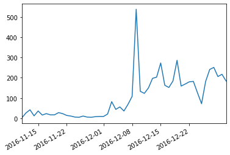
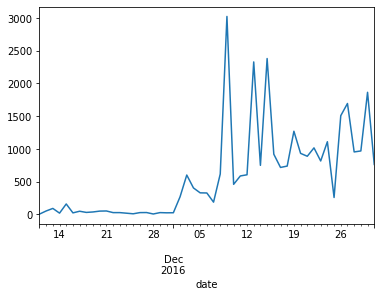

# Scraping Twitter with Twint

Twitter's [official API](https://developer.twitter.com/en/docs) is powerful is some ways, but fairly restrictive in the volume and pace of data collection. While social scientists are often interested in data from months or years ago, Twitter's [Standard Search API](https://developer.twitter.com/en/docs/tweets/search/overview) only goes back seven days. The cost of [purchasing historical Twitter data](https://developer.twitter.com/en/docs/tutorials/choosing-historical-api) is often out of reach of the average social scientist and even aquiring an API key has become increasingly difficult.

However, all of public Twitter is still available through its standard web interface. The Python library [twint](https://github.com/twintproject/twint) takes advantage of this so you can collect data from Twitter without using the API. While it's pretty powerful, one major limitation is that while it gives the count of times something has been liked or retweeted, it does not return who liked or retweeted it.

In this notebook, I walk throught the basics of twint.

## Installation

I used a two-step process to install twint. First, I used conda to install the required packages that were available through the conda-forge. In my experience, conda packages always work, but the same isn't true for pip. In this specific case, I couldn't get one of the twint dependencies (cchardet) to build through pip, so I had to use conda. 

Before installation, it is helpful to make sure you have the most up-to-date version of conda. Unfortunately, one of the consequences of conda's careful package management is that it can be slow.


{:.input_area}
```python
%conda update -n base -c defaults conda
```


{:.output .output_stream}
```
Collecting package metadata (repodata.json): done
Solving environment: done

## Package Plan ##

  environment location: /Users/nealcaren/anaconda3

  added / updated specs:
    - conda


The following packages will be downloaded:

    package                    |            build
    ---------------------------|-----------------
    cffi-1.14.0                |   py36hb5b8e2f_0         218 KB
    cloudpickle-1.3.0          |             py_0          29 KB
    cython-0.29.15             |   py36h0a44026_0         2.1 MB
    intel-openmp-2020.0        |              166         1.1 MB
    json5-0.9.1                |             py_0          26 KB
    parso-0.6.1                |             py_0          69 KB
    pyodbc-4.0.30              |   py36h0a44026_0          66 KB
    setuptools-45.2.0          |           py36_0         655 KB
    sphinx-2.4.0               |             py_0         1.4 MB
    sphinxcontrib-websupport-1.2.0|             py_0          35 KB
    tornado-6.0.3              |   py36h1de35cc_3         643 KB
    tqdm-4.42.1                |             py_0          56 KB
    watchdog-0.10.2            |   py36h1de35cc_0          98 KB
    werkzeug-1.0.0             |             py_0         243 KB
    zipp-2.2.0                 |             py_0          12 KB
    ------------------------------------------------------------
                                           Total:         6.7 MB

The following packages will be REMOVED:

  inflect-4.1.0-py36_0
  jaraco.itertools-5.0.0-py_0
  pyobjc-core-6.1-py36_0
  pyobjc-framework-cocoa-6.1-py36_0
  pyobjc-framework-fsevents-6.1-py36_0

The following packages will be UPDATED:

  cffi                                1.13.2-py36hb5b8e2f_0 --> 1.14.0-py36hb5b8e2f_0
  cloudpickle                                    1.2.2-py_0 --> 1.3.0-py_0
  cython                             0.29.14-py36h0a44026_0 --> 0.29.15-py36h0a44026_0
  intel-openmp                                   2019.4-233 --> 2020.0-166
  json5                                          0.9.0-py_0 --> 0.9.1-py_0
  parso                                          0.6.0-py_0 --> 0.6.1-py_0
  pyodbc                              4.0.28-py36h0a44026_0 --> 4.0.30-py36h0a44026_0
  setuptools                                  45.1.0-py36_0 --> 45.2.0-py36_0
  sphinx                                         2.3.1-py_0 --> 2.4.0-py_0
  sphinxcontrib-web~                             1.1.2-py_0 --> 1.2.0-py_0
  tornado                              6.0.3-py36h1de35cc_0 --> 6.0.3-py36h1de35cc_3
  tqdm                                          4.42.0-py_0 --> 4.42.1-py_0
  watchdog                            0.10.1-py36h1de35cc_0 --> 0.10.2-py36h1de35cc_0
  werkzeug                                      0.16.1-py_0 --> 1.0.0-py_0
  zipp                                           2.1.0-py_0 --> 2.2.0-py_0


Downloading and Extracting Packages
watchdog-0.10.2      | 98 KB     | ##################################### | 100% 
cffi-1.14.0          | 218 KB    | ##################################### | 100% 
parso-0.6.1          | 69 KB     | ##################################### | 100% 
zipp-2.2.0           | 12 KB     | ##################################### | 100% 
cython-0.29.15       | 2.1 MB    | ##################################### | 100% 
pyodbc-4.0.30        | 66 KB     | ##################################### | 100% 
setuptools-45.2.0    | 655 KB    | ##################################### | 100% 
tornado-6.0.3        | 643 KB    | ##################################### | 100% 
json5-0.9.1          | 26 KB     | ##################################### | 100% 
tqdm-4.42.1          | 56 KB     | ##################################### | 100% 
sphinx-2.4.0         | 1.4 MB    | ##################################### | 100% 
sphinxcontrib-websup | 35 KB     | ##################################### | 100% 
intel-openmp-2020.0  | 1.1 MB    | ##################################### | 100% 
werkzeug-1.0.0       | 243 KB    | ##################################### | 100% 
cloudpickle-1.3.0    | 29 KB     | ##################################### | 100% 
Preparing transaction: done
Verifying transaction: done
Executing transaction: done

Note: you may need to restart the kernel to use updated packages.

```


{:.input_area}
```python
%conda install -c conda-forge aiohttp  pysocks geopy googletrans cchardet nest-asyncio
```


{:.output .output_stream}
```
Collecting package metadata (repodata.json): done
Solving environment: - 
Warning: 4 possible package resolutions (only showing differing packages):
  - anaconda/osx-64::ca-certificates-2019.8.28-0, anaconda/osx-64::openssl-1.1.1d-h1de35cc_2
  - anaconda/osx-64::openssl-1.1.1d-h1de35cc_2, defaults/osx-64::ca-certificates-2019.8.28-0
  - anaconda/osx-64::ca-certificates-2019.8.28-0, defaults/osx-64::openssl-1.1.1d-h1de35cc_2
  - defaults/osx-64::ca-certificates-2019.8.28-0, defaults/osx-64::openssl-1.1.1d-h1de35ccdone

# All requested packages already installed.


Note: you may need to restart the kernel to use updated packages.

```

The second step is to `%pip` install twint. 


{:.input_area}
```python
%pip install twint
```


{:.output .output_stream}
```
Requirement already satisfied: twint in /Users/nealcaren/anaconda3/envs/twint/lib/python3.7/site-packages (2.1.12)
Requirement already satisfied: googletransx in /Users/nealcaren/anaconda3/envs/twint/lib/python3.7/site-packages (from twint) (2.4.2)
Requirement already satisfied: fake-useragent in /Users/nealcaren/anaconda3/envs/twint/lib/python3.7/site-packages (from twint) (0.1.11)
Requirement already satisfied: cchardet in /Users/nealcaren/anaconda3/envs/twint/lib/python3.7/site-packages (from twint) (2.1.4)
Requirement already satisfied: pandas in /Users/nealcaren/anaconda3/envs/twint/lib/python3.7/site-packages (from twint) (0.25.1)
Requirement already satisfied: geopy in /Users/nealcaren/anaconda3/envs/twint/lib/python3.7/site-packages (from twint) (1.21.0)
Requirement already satisfied: pysocks in /Users/nealcaren/anaconda3/envs/twint/lib/python3.7/site-packages (from twint) (1.7.1)
Requirement already satisfied: schedule in /Users/nealcaren/anaconda3/envs/twint/lib/python3.7/site-packages (from twint) (0.6.0)
Requirement already satisfied: aiodns in /Users/nealcaren/anaconda3/envs/twint/lib/python3.7/site-packages (from twint) (2.0.0)
Requirement already satisfied: elasticsearch in /Users/nealcaren/anaconda3/envs/twint/lib/python3.7/site-packages (from twint) (7.5.1)
Requirement already satisfied: aiohttp in /Users/nealcaren/anaconda3/envs/twint/lib/python3.7/site-packages (from twint) (3.6.2)
Requirement already satisfied: aiohttp-socks in /Users/nealcaren/anaconda3/envs/twint/lib/python3.7/site-packages (from twint) (0.3.4)
Requirement already satisfied: beautifulsoup4 in /Users/nealcaren/anaconda3/envs/twint/lib/python3.7/site-packages (from twint) (4.8.0)
Requirement already satisfied: requests in /Users/nealcaren/anaconda3/envs/twint/lib/python3.7/site-packages (from googletransx->twint) (2.22.0)
Requirement already satisfied: numpy>=1.13.3 in /Users/nealcaren/anaconda3/envs/twint/lib/python3.7/site-packages (from pandas->twint) (1.17.2)
Requirement already satisfied: pytz>=2017.2 in /Users/nealcaren/anaconda3/envs/twint/lib/python3.7/site-packages (from pandas->twint) (2019.3)
Requirement already satisfied: python-dateutil>=2.6.1 in /Users/nealcaren/anaconda3/envs/twint/lib/python3.7/site-packages (from pandas->twint) (2.8.0)
Requirement already satisfied: geographiclib<2,>=1.49 in /Users/nealcaren/anaconda3/envs/twint/lib/python3.7/site-packages (from geopy->twint) (1.50)
Requirement already satisfied: pycares>=3.0.0 in /Users/nealcaren/anaconda3/envs/twint/lib/python3.7/site-packages (from aiodns->twint) (3.1.1)
Requirement already satisfied: urllib3>=1.21.1 in /Users/nealcaren/anaconda3/envs/twint/lib/python3.7/site-packages (from elasticsearch->twint) (1.24.2)
Requirement already satisfied: multidict<5.0,>=4.5 in /Users/nealcaren/anaconda3/envs/twint/lib/python3.7/site-packages (from aiohttp->twint) (4.7.4)
Requirement already satisfied: async-timeout<4.0,>=3.0 in /Users/nealcaren/anaconda3/envs/twint/lib/python3.7/site-packages (from aiohttp->twint) (3.0.1)
Requirement already satisfied: yarl<2.0,>=1.0 in /Users/nealcaren/anaconda3/envs/twint/lib/python3.7/site-packages (from aiohttp->twint) (1.3.0)
Requirement already satisfied: chardet<4.0,>=2.0 in /Users/nealcaren/anaconda3/envs/twint/lib/python3.7/site-packages (from aiohttp->twint) (3.0.4)
Requirement already satisfied: attrs>=17.3.0 in /Users/nealcaren/anaconda3/envs/twint/lib/python3.7/site-packages (from aiohttp->twint) (19.2.0)
Requirement already satisfied: soupsieve>=1.2 in /Users/nealcaren/anaconda3/envs/twint/lib/python3.7/site-packages (from beautifulsoup4->twint) (1.9.3)
Requirement already satisfied: certifi>=2017.4.17 in /Users/nealcaren/anaconda3/envs/twint/lib/python3.7/site-packages (from requests->googletransx->twint) (2019.9.11)
Requirement already satisfied: idna<2.9,>=2.5 in /Users/nealcaren/anaconda3/envs/twint/lib/python3.7/site-packages (from requests->googletransx->twint) (2.8)
Requirement already satisfied: six>=1.5 in /Users/nealcaren/anaconda3/envs/twint/lib/python3.7/site-packages (from python-dateutil>=2.6.1->pandas->twint) (1.12.0)
Requirement already satisfied: cffi>=1.5.0 in /Users/nealcaren/anaconda3/envs/twint/lib/python3.7/site-packages (from pycares>=3.0.0->aiodns->twint) (1.12.3)
Requirement already satisfied: pycparser in /Users/nealcaren/anaconda3/envs/twint/lib/python3.7/site-packages (from cffi>=1.5.0->pycares>=3.0.0->aiodns->twint) (2.19)
Note: you may need to restart the kernel to use updated packages.

```

The `%conda` and `%pip` commands only need to be run once.

## Basic search usage

In addition to the `twint` library, `nest_asyncio` needs to be imported when `twint` is employed in a notebook. `nest_asyncio` is used once to enable concurrent actions within a Jupyter notebook. 


{:.input_area}
```python
import twint
import nest_asyncio

nest_asyncio.apply()
```


Before searching, you need to configure the search parameters. A straightforward search might ask for the twenty most recent mentions of #blacklivesmatter. 


{:.input_area}
```python
c = twint.Config()

c.Search = '#blacklivesmatter'
c.Limit = 20
```


The configuration parameters are passed to the `Search' function.


{:.input_area}
```python
twint.run.Search(c)
```


{:.output .output_stream}
```
1231975589361274881 2020-02-24 11:14:04 EST <PuterGeek7> The best picture #Bernie2020 #BernieSanders #BernieSanders2020 #Bernie #BernieBeatsTrump #DemocraticSocialism #Progressive #Progressives #BlackLivesMatter @Latinos4Bernie @BerniePride @LGBT4Bernie @LGBTforBernie @BlacksForBernie @LostDiva #Road2Bernie https://twitter.com/breandad512/status/1231839419654688770 …
1231975472621346817 2020-02-24 11:13:36 EST <titi_babydoll> #MLK #BlackHistoryMonth2020 #illkneel #BlackLivesMatter #berniesanders #VoteBlue #whitemoderate #inspirational #leader #PoorPeoplesCampaign  Order vs Justice Negative Peace vs Positive Peace https://twitter.com/revdrbarber/status/1231953273852219394 …
1231974971641147393 2020-02-24 11:11:36 EST <Trumpagainstds> #Resist #MondayMood #KAGA2020 #ImpeachTrumpAgain #MondayVibes #mondaythoughts #DemocratsAreCorrupt #BlackLivesMatter #Trump2020 #TrumpIsARussianAsset #WalkAway  Based on New York Times article. https://www.businessinsider.com/the-clintons-putin-and-uranium-2015-4?op=1 …
1231974085619601409 2020-02-24 11:08:05 EST <KnockMf> How many did Bloomberg march in ? Does Bloomberg support #BlackLivesMatter ? How did the NYPD treat minorities under his leadership in NYC ? I’ll wait on those answers
1231973537499533312 2020-02-24 11:05:54 EST <hottargets2020> #BlackLivesMatter DONT SHOOT NYLA ‼️‼️‼️  https://twitter.com/nerfwhs/status/1231647403650027520 …
1231973377633505280 2020-02-24 11:05:16 EST <PuterGeek7> #Bernie2020 #BernieSanders #BernieSanders2020 #Bernie #BernieBeatsTrump #DemocraticSocialism #Progressive #Progressives #BlackLivesMatter @Latinos4Bernie @BerniePride @LGBT4Bernie @LGBTforBernie @BlacksForBernie @LostDiva #Road2Bernie https://twitter.com/exrayfusion/status/1231970394556395520 …
1231972590559756288 2020-02-24 11:02:09 EST <leet_tees> My Black Life Matters. All lives matter, but the ones really hurting right now is the African American community.  Support all human life, no matter the shade. #BlackLivesMatter #BlackHistoryMonth #BlackOwned #BlackGirlMagic  https://teespring.com/my-black-life-matters?cid=2397&page=1&pid=2&tsmac=store&tsmic=leet-tees … pic.twitter.com/4P71WK3lF7
1231972175395115008 2020-02-24 11:00:30 EST <EvolvingManLBV> Y'all get my man @Kaepernick7 fired and blacklisted for kneeling for his 1st Amendment rights in the name of #BlackLivesMatter GTFO!  pic.twitter.com/xdEEh2IHLb
1231972099893288962 2020-02-24 11:00:12 EST <PuterGeek7> #Bernie2020 #BernieSanders #BernieSanders2020 #Bernie #BernieBeatsTrump #DemocraticSocialism #Progressive #Progressives #BlackLivesMatter @Latinos4Bernie @BerniePride @LGBT4Bernie @LGBTforBernie @BlacksForBernie @LostDiva #Road2Bernie https://twitter.com/benjaminpdixon/status/1231925614447398919 …
1231971842866532352 2020-02-24 10:59:10 EST <ToadOff> Can you imagine if it had been group of black youths who pushed a white boy into the river? Why is it not in the public intetest; I'm a member of the public and I'm interested to see justice done!  #interestedpublic #justiceforchristopher #blacklivesmatter  https://twitter.com/ToadOff/status/1231942955017134080 …
1231971676478308352 2020-02-24 10:58:31 EST <Smedley_Butler> #BlackLivesMatter #BernieWon https://abc11.com/5961078/?fbclid=IwAR0BT-mNdwyrXSvL7NDdR3r3UkLc8Yj06vbjIgg6Dn0lIVCwJzUTqa-punE …
1231970636169240576 2020-02-24 10:54:23 EST <PuterGeek7> #Bernie2020 #BernieSanders #BernieSanders2020 #Bernie #BernieBeatsTrump #DemocraticSocialism #Progressive #Progressives #BlackLivesMatter @Latinos4Bernie @BerniePride @LGBT4Bernie @LGBTforBernie @BlacksForBernie @LostDiva #Road2Bernie https://twitter.com/people4bernie/status/1231748253923733504 …
1231970549653372929 2020-02-24 10:54:02 EST <jdawncarlson> @profjournalista's study traces post-#Ferguson shifts in journalism: less typecasting of protesters, more analysis of structural racism, & more diverse voices.  Confirms @j_cobbina's analysis that #BlackLivesMatter transformed US racial politics.     https://link.springer.com/chapter/10.1007/978-3-030-35221-9_3 …
1231970478635413504 2020-02-24 10:53:45 EST <CathesComicz> Black History matters. #blacklivesmatter  https://twitter.com/NPR/status/1231965410435780608 …
1231970136208347137 2020-02-24 10:52:24 EST <hollywoodcurry> #Rip: Katherine Johnson, one of the women profiled in the hit film "Hidden Figures," died today at 101.  She was a black mathematician who calculated the flight path for America's first space mission and the first landing on the moon. #BlackHistoryMonth #BlackLivesMatter  pic.twitter.com/JO3flIaHKS
1231969603804442626 2020-02-24 10:50:17 EST <Thecheekygenius> Dear #BlackTwitter & #blackpeopletwitter remember in South Carolina that #BlackLivesMatter #Obama wanted what #BernieSanders is trying to give you😑 #MedicareForAll #Obamacare is what the #GOP gave you. #JoeBiden2020 wants your kids to pay for college. Don't be stupid. #NotMeUs
1231969179688984577 2020-02-24 10:48:35 EST <Lifeskills0> 'Hidden Figures' scientist Johnson dies at 101 #blacklivesmatter #blacktwitter http://a.msn.com/01/en-us/BB10kABC?ocid=st2 …
1231968927657447424 2020-02-24 10:47:35 EST <Faithslayer202> #Liberals #LiberalsForBernie #Progressives #ProgressivesForBernie #WomenForBernie #MenForBernie #BlackLivesMatter. #UnionsForBernie #UnionWorkersForBernie #StudentsForBernie #PeopleForBernie #MillennialsForBernie #LatinosForBernie #LaborForBernie #SunriseMovement #OurRevolution
1231968786787524611 2020-02-24 10:47:02 EST <Trumpagainstds> #Resist #MondayMood #KAGA2020 #ImpeachTrumpAgain #DonaldTrump #mondaythoughts #DemocratsAreCorrupt #BlackLivesMatter #Trump2020 #TrumpIsARussianAsset @SenateGOP #WalkAway https://www.redstate.com/streiff/2017/03/03/nancy-pelosi-caught-lying-nation-russian-intelligence-contacts/ …
1231967800048091140 2020-02-24 10:43:07 EST <1person9neurons> #BlackLivesMatter

```

The function displays the tweet id, date, time, user, and content of the tweets matching the search parameters. While this display is useful for making sure the results match what you expected, they aren't stored anywhere. 

One storage solution is to output the results to a pandas dataframe. This setting update is done with the Pandas parameter of your search object.


{:.input_area}
```python
import pandas as pd 

c = twint.Config()

c.Search = '#blacklivesmatter'
c.Limit = 20
c.Pandas = True
```


Run the search again with the new setting.


{:.input_area}
```python
twint.run.Search(c)

```


{:.output .output_stream}
```
1231975589361274881 2020-02-24 11:14:04 EST <PuterGeek7> The best picture #Bernie2020 #BernieSanders #BernieSanders2020 #Bernie #BernieBeatsTrump #DemocraticSocialism #Progressive #Progressives #BlackLivesMatter @Latinos4Bernie @BerniePride @LGBT4Bernie @LGBTforBernie @BlacksForBernie @LostDiva #Road2Bernie https://twitter.com/breandad512/status/1231839419654688770 …
1231975472621346817 2020-02-24 11:13:36 EST <titi_babydoll> #MLK #BlackHistoryMonth2020 #illkneel #BlackLivesMatter #berniesanders #VoteBlue #whitemoderate #inspirational #leader #PoorPeoplesCampaign  Order vs Justice Negative Peace vs Positive Peace https://twitter.com/revdrbarber/status/1231953273852219394 …
1231974971641147393 2020-02-24 11:11:36 EST <Trumpagainstds> #Resist #MondayMood #KAGA2020 #ImpeachTrumpAgain #MondayVibes #mondaythoughts #DemocratsAreCorrupt #BlackLivesMatter #Trump2020 #TrumpIsARussianAsset #WalkAway  Based on New York Times article. https://www.businessinsider.com/the-clintons-putin-and-uranium-2015-4?op=1 …
1231974085619601409 2020-02-24 11:08:05 EST <KnockMf> How many did Bloomberg march in ? Does Bloomberg support #BlackLivesMatter ? How did the NYPD treat minorities under his leadership in NYC ? I’ll wait on those answers
1231973537499533312 2020-02-24 11:05:54 EST <hottargets2020> #BlackLivesMatter DONT SHOOT NYLA ‼️‼️‼️  https://twitter.com/nerfwhs/status/1231647403650027520 …
1231973377633505280 2020-02-24 11:05:16 EST <PuterGeek7> #Bernie2020 #BernieSanders #BernieSanders2020 #Bernie #BernieBeatsTrump #DemocraticSocialism #Progressive #Progressives #BlackLivesMatter @Latinos4Bernie @BerniePride @LGBT4Bernie @LGBTforBernie @BlacksForBernie @LostDiva #Road2Bernie https://twitter.com/exrayfusion/status/1231970394556395520 …
1231972590559756288 2020-02-24 11:02:09 EST <leet_tees> My Black Life Matters. All lives matter, but the ones really hurting right now is the African American community.  Support all human life, no matter the shade. #BlackLivesMatter #BlackHistoryMonth #BlackOwned #BlackGirlMagic  https://teespring.com/my-black-life-matters?cid=2397&page=1&pid=2&tsmac=store&tsmic=leet-tees … pic.twitter.com/4P71WK3lF7
1231972175395115008 2020-02-24 11:00:30 EST <EvolvingManLBV> Y'all get my man @Kaepernick7 fired and blacklisted for kneeling for his 1st Amendment rights in the name of #BlackLivesMatter GTFO!  pic.twitter.com/xdEEh2IHLb
1231972099893288962 2020-02-24 11:00:12 EST <PuterGeek7> #Bernie2020 #BernieSanders #BernieSanders2020 #Bernie #BernieBeatsTrump #DemocraticSocialism #Progressive #Progressives #BlackLivesMatter @Latinos4Bernie @BerniePride @LGBT4Bernie @LGBTforBernie @BlacksForBernie @LostDiva #Road2Bernie https://twitter.com/benjaminpdixon/status/1231925614447398919 …
1231971842866532352 2020-02-24 10:59:10 EST <ToadOff> Can you imagine if it had been group of black youths who pushed a white boy into the river? Why is it not in the public intetest; I'm a member of the public and I'm interested to see justice done!  #interestedpublic #justiceforchristopher #blacklivesmatter  https://twitter.com/ToadOff/status/1231942955017134080 …
1231971676478308352 2020-02-24 10:58:31 EST <Smedley_Butler> #BlackLivesMatter #BernieWon https://abc11.com/5961078/?fbclid=IwAR0BT-mNdwyrXSvL7NDdR3r3UkLc8Yj06vbjIgg6Dn0lIVCwJzUTqa-punE …
1231970636169240576 2020-02-24 10:54:23 EST <PuterGeek7> #Bernie2020 #BernieSanders #BernieSanders2020 #Bernie #BernieBeatsTrump #DemocraticSocialism #Progressive #Progressives #BlackLivesMatter @Latinos4Bernie @BerniePride @LGBT4Bernie @LGBTforBernie @BlacksForBernie @LostDiva #Road2Bernie https://twitter.com/people4bernie/status/1231748253923733504 …
1231970549653372929 2020-02-24 10:54:02 EST <jdawncarlson> @profjournalista's study traces post-#Ferguson shifts in journalism: less typecasting of protesters, more analysis of structural racism, & more diverse voices.  Confirms @j_cobbina's analysis that #BlackLivesMatter transformed US racial politics.     https://link.springer.com/chapter/10.1007/978-3-030-35221-9_3 …
1231970478635413504 2020-02-24 10:53:45 EST <CathesComicz> Black History matters. #blacklivesmatter  https://twitter.com/NPR/status/1231965410435780608 …
1231970136208347137 2020-02-24 10:52:24 EST <hollywoodcurry> #Rip: Katherine Johnson, one of the women profiled in the hit film "Hidden Figures," died today at 101.  She was a black mathematician who calculated the flight path for America's first space mission and the first landing on the moon. #BlackHistoryMonth #BlackLivesMatter  pic.twitter.com/JO3flIaHKS
1231969603804442626 2020-02-24 10:50:17 EST <Thecheekygenius> Dear #BlackTwitter & #blackpeopletwitter remember in South Carolina that #BlackLivesMatter #Obama wanted what #BernieSanders is trying to give you😑 #MedicareForAll #Obamacare is what the #GOP gave you. #JoeBiden2020 wants your kids to pay for college. Don't be stupid. #NotMeUs
1231969179688984577 2020-02-24 10:48:35 EST <Lifeskills0> 'Hidden Figures' scientist Johnson dies at 101 #blacklivesmatter #blacktwitter http://a.msn.com/01/en-us/BB10kABC?ocid=st2 …
1231968927657447424 2020-02-24 10:47:35 EST <Faithslayer202> #Liberals #LiberalsForBernie #Progressives #ProgressivesForBernie #WomenForBernie #MenForBernie #BlackLivesMatter. #UnionsForBernie #UnionWorkersForBernie #StudentsForBernie #PeopleForBernie #MillennialsForBernie #LatinosForBernie #LaborForBernie #SunriseMovement #OurRevolution
1231968786787524611 2020-02-24 10:47:02 EST <Trumpagainstds> #Resist #MondayMood #KAGA2020 #ImpeachTrumpAgain #DonaldTrump #mondaythoughts #DemocratsAreCorrupt #BlackLivesMatter #Trump2020 #TrumpIsARussianAsset @SenateGOP #WalkAway https://www.redstate.com/streiff/2017/03/03/nancy-pelosi-caught-lying-nation-russian-intelligence-contacts/ …
1231967800048091140 2020-02-24 10:43:07 EST <1person9neurons> #BlackLivesMatter

```

If someone tweeted about #blacklivesmatter inbetween the two searches, your results will differ. You can store the results in a dataframe and display a sample of the responses.


{:.input_area}
```python
df = twint.storage.panda.Tweets_df

df.sample(5)
```


<div markdown="0" class="output output_html">
<div>
<style scoped>
    .dataframe tbody tr th:only-of-type {
        vertical-align: middle;
    }

    .dataframe tbody tr th {
        vertical-align: top;
    }

    .dataframe thead th {
        text-align: right;
    }
</style>
<table border="1" class="dataframe">
  <thead>
    <tr style="text-align: right;">
      <th></th>
      <th>id</th>
      <th>conversation_id</th>
      <th>created_at</th>
      <th>date</th>
      <th>timezone</th>
      <th>place</th>
      <th>tweet</th>
      <th>hashtags</th>
      <th>cashtags</th>
      <th>user_id</th>
      <th>...</th>
      <th>geo</th>
      <th>source</th>
      <th>user_rt_id</th>
      <th>user_rt</th>
      <th>retweet_id</th>
      <th>reply_to</th>
      <th>retweet_date</th>
      <th>translate</th>
      <th>trans_src</th>
      <th>trans_dest</th>
    </tr>
  </thead>
  <tbody>
    <tr>
      <th>5</th>
      <td>1231973377633505280</td>
      <td>1231973377633505280</td>
      <td>1582560316000</td>
      <td>2020-02-24 11:05:16</td>
      <td>EST</td>
      <td></td>
      <td>#Bernie2020 #BernieSanders #BernieSanders2020 ...</td>
      <td>[#bernie2020, #berniesanders, #berniesanders20...</td>
      <td>[]</td>
      <td>1213716872945795073</td>
      <td>...</td>
      <td></td>
      <td></td>
      <td></td>
      <td></td>
      <td></td>
      <td>[{'user_id': '1213716872945795073', 'username'...</td>
      <td></td>
      <td></td>
      <td></td>
      <td></td>
    </tr>
    <tr>
      <th>7</th>
      <td>1231972175395115008</td>
      <td>1231797010820403200</td>
      <td>1582560030000</td>
      <td>2020-02-24 11:00:30</td>
      <td>EST</td>
      <td></td>
      <td>Y'all get my man @Kaepernick7 fired and blackl...</td>
      <td>[#blacklivesmatter]</td>
      <td>[]</td>
      <td>701208785331875840</td>
      <td>...</td>
      <td></td>
      <td></td>
      <td></td>
      <td></td>
      <td></td>
      <td>[{'user_id': '701208785331875840', 'username':...</td>
      <td></td>
      <td></td>
      <td></td>
      <td></td>
    </tr>
    <tr>
      <th>8</th>
      <td>1231972099893288962</td>
      <td>1231972099893288962</td>
      <td>1582560012000</td>
      <td>2020-02-24 11:00:12</td>
      <td>EST</td>
      <td></td>
      <td>#Bernie2020 #BernieSanders #BernieSanders2020 ...</td>
      <td>[#bernie2020, #berniesanders, #berniesanders20...</td>
      <td>[]</td>
      <td>1213716872945795073</td>
      <td>...</td>
      <td></td>
      <td></td>
      <td></td>
      <td></td>
      <td></td>
      <td>[{'user_id': '1213716872945795073', 'username'...</td>
      <td></td>
      <td></td>
      <td></td>
      <td></td>
    </tr>
    <tr>
      <th>15</th>
      <td>1231969603804442626</td>
      <td>1231969603804442626</td>
      <td>1582559417000</td>
      <td>2020-02-24 10:50:17</td>
      <td>EST</td>
      <td></td>
      <td>Dear #BlackTwitter &amp; #blackpeopletwitter remem...</td>
      <td>[#blacktwitter, #blackpeopletwitter, #blackliv...</td>
      <td>[]</td>
      <td>996857178400219137</td>
      <td>...</td>
      <td></td>
      <td></td>
      <td></td>
      <td></td>
      <td></td>
      <td>[{'user_id': '996857178400219137', 'username':...</td>
      <td></td>
      <td></td>
      <td></td>
      <td></td>
    </tr>
    <tr>
      <th>17</th>
      <td>1231968927657447424</td>
      <td>1231968924796903434</td>
      <td>1582559255000</td>
      <td>2020-02-24 10:47:35</td>
      <td>EST</td>
      <td></td>
      <td>#Liberals #LiberalsForBernie #Progressives #Pr...</td>
      <td>[#liberals, #liberalsforbernie, #progressives,...</td>
      <td>[]</td>
      <td>2717187818</td>
      <td>...</td>
      <td></td>
      <td></td>
      <td></td>
      <td></td>
      <td></td>
      <td>[{'user_id': '2717187818', 'username': 'Faiths...</td>
      <td></td>
      <td></td>
      <td></td>
      <td></td>
    </tr>
  </tbody>
</table>
<p>5 rows × 33 columns</p>
</div>
</div>


The dataframe includes more information than was displayed. 


{:.input_area}
```python
df.info()
```


{:.output .output_stream}
```
<class 'pandas.core.frame.DataFrame'>
RangeIndex: 20 entries, 0 to 19
Data columns (total 33 columns):
id                 20 non-null object
conversation_id    20 non-null object
created_at         20 non-null int64
date               20 non-null object
timezone           20 non-null object
place              20 non-null object
tweet              20 non-null object
hashtags           20 non-null object
cashtags           20 non-null object
user_id            20 non-null int64
user_id_str        20 non-null object
username           20 non-null object
name               20 non-null object
day                20 non-null int64
hour               20 non-null object
link               20 non-null object
retweet            20 non-null bool
nlikes             20 non-null int64
nreplies           20 non-null int64
nretweets          20 non-null int64
quote_url          20 non-null object
search             20 non-null object
near               20 non-null object
geo                20 non-null object
source             20 non-null object
user_rt_id         20 non-null object
user_rt            20 non-null object
retweet_id         20 non-null object
reply_to           20 non-null object
retweet_date       20 non-null object
translate          20 non-null object
trans_src          20 non-null object
trans_dest         20 non-null object
dtypes: bool(1), int64(6), object(26)
memory usage: 5.1+ KB

```

Like any other dataframe, this one can be stored in csv or json format for later analysis.


{:.input_area}
```python
df.to_csv('blm_20.csv', index=False)
```


### An Example: #womensmarch

For most social science projects, you would not be interested in the most recent tweets, but rather those from a fixed time period. Gathering historical data is also a particular strength of twint. 

To study the early days of the Women's March on Twitter, you can use the `Since` and `Until` parametrs to select a date range. These should be of the "YYYY-MM-DD" format and the search includes up to, but not including the `Until` date. 

The `Hide_output` can be set to `False` to hide the tweet scroll. Notebooks don't handle massive text displays well, so hiding the output is important in large scale data collection.

Finally, the results can be stored directly to a file in the JSON format using the `Store_json` and `Output` parameters. The file is updated after every call to Twitter. 


{:.input_area}
```python
c = twint.Config()

c.Search = '#womensmarch'

c.Since = '2016-11-01'
c.Until = '2017-01-01'

c.Hide_output = True

c.Store_json = True
c.Output = 'womensmarch_2016.json'

```


Running the search takes about 5 minutes.


{:.input_area}
```python
twint.run.Search(c)
```


The resulting file is 5.5 MBs of tweet meta data. The information can be read back into Python as a dataframe. Since the tweets are line seperated, the `lines` parameter needs to set to `True` in the `read_json` command.


{:.input_area}
```python
df = pd.read_json('womensmarch_2016.json' , lines = True)

df.info()
```


{:.output .output_stream}
```
<class 'pandas.core.frame.DataFrame'>
RangeIndex: 5313 entries, 0 to 5312
Data columns (total 34 columns):
id                 5313 non-null int64
conversation_id    5313 non-null int64
created_at         5313 non-null datetime64[ns]
date               5313 non-null datetime64[ns]
time               5313 non-null object
timezone           5313 non-null object
user_id            5313 non-null int64
username           5313 non-null object
name               5313 non-null object
place              5313 non-null object
tweet              5313 non-null object
mentions           5313 non-null object
urls               5313 non-null object
photos             5313 non-null object
replies_count      5313 non-null int64
retweets_count     5313 non-null int64
likes_count        5313 non-null int64
hashtags           5313 non-null object
cashtags           5313 non-null object
link               5313 non-null object
retweet            5313 non-null bool
quote_url          5313 non-null object
video              5313 non-null int64
near               5313 non-null object
geo                5313 non-null object
source             5313 non-null object
user_rt_id         5313 non-null object
user_rt            5313 non-null object
retweet_id         5313 non-null object
reply_to           5313 non-null object
retweet_date       5313 non-null object
translate          5313 non-null object
trans_src          5313 non-null object
trans_dest         5313 non-null object
dtypes: bool(1), datetime64[ns](2), int64(7), object(24)
memory usage: 1.3+ MB

```

The dataframe contains information on 5,370 tweets. Plotting the frequency by day, it appears that December 9th contained the greatest number of tweets with the hashtag.


{:.input_area}
```python
%matplotlib inline

df['date'].value_counts().plot()
```


{:.output .output_data_text}
```
<matplotlib.axes._subplots.AxesSubplot at 0x114911790>
```


{:.output .output_png}



You can also count frequency including retweets by constructing a new variable that is the number of retweets plus one (the original tweet). This shows a slightly different trend, with several new peaks.


{:.input_area}
```python
df['tweet_counts'] = df['retweets_count'] + 1

df.groupby(df["date"]).sum()["tweet_counts"].plot()
```


{:.output .output_data_text}
```
<matplotlib.axes._subplots.AxesSubplot at 0x1140ea690>
```


{:.output .output_png}



You can take advantage of the fact that the tweet meta data provides a link to the original tweet and that Python can display HTML to visualize the tweets in your notebook. First, a small function to get and display the tweet based on the link url.


{:.input_area}
```python
from IPython.display import HTML
import requests

def show_tweet(link):
    '''Display the contents of a tweet. '''
    url = 'https://publish.twitter.com/oembed?url=%s' % link
    response = requests.get(url)
    html = response.json()["html"]
    display(HTML(html))

```


The function can be tested on a sample link.


{:.input_area}
```python
sample_tweet_link = df.sample(1)['link'].values[0]
display(sample_tweet_link)
show_tweet(sample_tweet_link)
```


{:.output .output_data_text}
```
'https://twitter.com/EndHateRadio/status/800472193943552000'
```


<div markdown="0" class="output output_html">
<blockquote class="twitter-tweet"><p lang="en" dir="ltr">MA tweeps, there is a big <a href="https://twitter.com/hashtag/WomensMarch?src=hash&amp;ref_src=twsrc%5Etfw">#WomensMarch</a> in Boston starting to take shape! If you have one in your state, DM me! <a href="https://t.co/8uEKu7KUxW">https://t.co/8uEKu7KUxW</a></p>&mdash; end hate radio (@EndHateRadio) <a href="https://twitter.com/EndHateRadio/status/800472193943552000?ref_src=twsrc%5Etfw">November 20, 2016</a></blockquote>
<script async src="https://platform.twitter.com/widgets.js" charset="utf-8"></script>

</div>


The top few can be displayed using a loop, with 🔥 as a seperator.


{:.input_area}
```python
# A list of the tweet urls, sorted by retweet count.
rt_links = df.sort_values(by= 'retweets_count', ascending = False)['link'].values

for url in rt_links[:5]:
    print('🔥 ' * 19)
    show_tweet(url)
```


{:.output .output_stream}
```
🔥 🔥 🔥 🔥 🔥 🔥 🔥 🔥 🔥 🔥 🔥 🔥 🔥 🔥 🔥 🔥 🔥 🔥 🔥 

```


<div markdown="0" class="output output_html">
<blockquote class="twitter-tweet"><p lang="en" dir="ltr">1.21.17 in Washington, D.C. LET&#39;S DO THIS. <a href="https://twitter.com/hashtag/WomensMarch?src=hash&amp;ref_src=twsrc%5Etfw">#WomensMarch</a> <a href="https://t.co/uzUjMFLWsm">pic.twitter.com/uzUjMFLWsm</a></p>&mdash; Women&#39;s March (@womensmarch) <a href="https://twitter.com/womensmarch/status/808714345081405440?ref_src=twsrc%5Etfw">December 13, 2016</a></blockquote>
<script async src="https://platform.twitter.com/widgets.js" charset="utf-8"></script>

</div>


{:.output .output_stream}
```
🔥 🔥 🔥 🔥 🔥 🔥 🔥 🔥 🔥 🔥 🔥 🔥 🔥 🔥 🔥 🔥 🔥 🔥 🔥 

```


<div markdown="0" class="output output_html">
<blockquote class="twitter-tweet"><p lang="en" dir="ltr">Come march with me in Washington, DC on January 21st, 2017! <a href="https://twitter.com/hashtag/whyIMarch?src=hash&amp;ref_src=twsrc%5Etfw">#whyIMarch</a> <a href="https://twitter.com/hashtag/WomensMarch?src=hash&amp;ref_src=twsrc%5Etfw">#WomensMarch</a> <a href="https://twitter.com/hashtag/wmw?src=hash&amp;ref_src=twsrc%5Etfw">#wmw</a> <a href="https://twitter.com/hashtag/protest?src=hash&amp;ref_src=twsrc%5Etfw">#protest</a> <a href="https://twitter.com/womensmarch?ref_src=twsrc%5Etfw">@womensmarch</a> ❤️ <a href="https://t.co/zw84iEmm0N">pic.twitter.com/zw84iEmm0N</a></p>&mdash; Amee Vanderpool (@girlsreallyrule) <a href="https://twitter.com/girlsreallyrule/status/809501619872092160?ref_src=twsrc%5Etfw">December 15, 2016</a></blockquote>
<script async src="https://platform.twitter.com/widgets.js" charset="utf-8"></script>

</div>


{:.output .output_stream}
```
🔥 🔥 🔥 🔥 🔥 🔥 🔥 🔥 🔥 🔥 🔥 🔥 🔥 🔥 🔥 🔥 🔥 🔥 🔥 

```


<div markdown="0" class="output output_html">
<blockquote class="twitter-tweet"><p lang="en" dir="ltr">We want EVERYONE who cares about women&#39;s rights to march with us on 1.21.17 in Washington, D.C. Who&#39;s coming? <a href="https://twitter.com/hashtag/WomensMarch?src=hash&amp;ref_src=twsrc%5Etfw">#WomensMarch</a> <a href="https://t.co/4DJDNUtasU">pic.twitter.com/4DJDNUtasU</a></p>&mdash; Women&#39;s March (@womensmarch) <a href="https://twitter.com/womensmarch/status/812688858768936960?ref_src=twsrc%5Etfw">December 24, 2016</a></blockquote>
<script async src="https://platform.twitter.com/widgets.js" charset="utf-8"></script>

</div>


{:.output .output_stream}
```
🔥 🔥 🔥 🔥 🔥 🔥 🔥 🔥 🔥 🔥 🔥 🔥 🔥 🔥 🔥 🔥 🔥 🔥 🔥 

```


<div markdown="0" class="output output_html">
<blockquote class="twitter-tweet"><p lang="en" dir="ltr">I had 5 white men in last week email asking to change name of <a href="https://twitter.com/hashtag/WomensMarch?src=hash&amp;ref_src=twsrc%5Etfw">#WomensMarch</a> to People&#39;s March. Can&#39;t bring themselves to follow women. 🤔🤔</p>&mdash; Linda Sarsour (@lsarsour) <a href="https://twitter.com/lsarsour/status/815024878759899136?ref_src=twsrc%5Etfw">December 31, 2016</a></blockquote>
<script async src="https://platform.twitter.com/widgets.js" charset="utf-8"></script>

</div>


{:.output .output_stream}
```
🔥 🔥 🔥 🔥 🔥 🔥 🔥 🔥 🔥 🔥 🔥 🔥 🔥 🔥 🔥 🔥 🔥 🔥 🔥 

```


<div markdown="0" class="output output_html">
<blockquote class="twitter-tweet"><p lang="en" dir="ltr">Trump administration so far:<br>Men: 13 of 18<br>Accused of rape: 1<br>Accused of domestic violence: 3<br>Voted against VAWA: 3<a href="https://twitter.com/hashtag/womensmarch?src=hash&amp;ref_src=twsrc%5Etfw">#womensmarch</a> <a href="https://twitter.com/hashtag/whyimarch?src=hash&amp;ref_src=twsrc%5Etfw">#whyimarch</a> <a href="https://t.co/npImmMbIgI">pic.twitter.com/npImmMbIgI</a></p>&mdash; Shannon Watts (@shannonrwatts) <a href="https://twitter.com/shannonrwatts/status/807328281531977728?ref_src=twsrc%5Etfw">December 9, 2016</a></blockquote>
<script async src="https://platform.twitter.com/widgets.js" charset="utf-8"></script>

</div>


### Production

If you are collecting a large number of tweets, something is likely to go wrong along the way. Two options can help minimize the damage. 

First, the `Resume` option allows you to store the ID of the most recent tweet that was collected. If your search gets interrupted,  you can run `twint.run.Search(c)` a second time, and the search will resume where it left off. This option is particularly useful if you lose internet access.  

Second, the `Debug` option allows you a behind-the-scenes look at what your Twitter scraper is doing. It creates two files in your current working directory. `twint-request_urls.log` lists the URL for each of the requests being made. If the results are not what you expected, you can copy and paste a URL into your browser window to manual inspect the results. `twint-last-request.log` contains what was returned by the most recent URL. 


{:.input_area}
```python
c = twint.Config()

c.Search = '#womensmarch'
c.Since = '2017-01-01'
c.Until = '2017-01-02'
c.Hide_output = True
c.Store_json = True
c.Output = 'womensmarch_2017.json'
c.Resume = 'wm_last.csv'
c.Debug = True


```


{:.input_area}
```python
twint.run.Search(c)
```


If the resulting json or other file is likley to be massive, you can split your search by date and create seperate files for each date. This also has the advantage that if something goes wrong, you can focus on a specific date.

The cell below creates several functions to automate the process of searching over several days and storing each day's results as distinct json file: `twint_loop` splits the date range into a series of days and calls `twint_search` to do the searching for each date. Each json is named after the date and stored in a directory based on the search term, using `clean_name` to ensure that it is a valide directory name. The date loop


{:.input_area}
```python
from datetime import timedelta
from string import ascii_letters, digits
from os import mkdir, path

def clean_name(dirname):
    valid = set(ascii_letters + digits)
    return ''.join(a for a in dirname if a in valid)


def twint_search(searchterm, since, until, json_name):
    '''
    Twint search for a specific date range.
    Stores results to json.
    '''
    c = twint.Config()
    c.Search = searchterm
    c.Since = since
    c.Until = until
    c.Hide_output = True
    c.Store_json = True
    c.Output = json_name
    c.Debug = True
    
    try:
        twint.run.Search(c)    
    except (KeyboardInterrupt, SystemExit):
        raise
    except:
        print("Problem with %s." % since)
    


def twint_loop(searchterm, since, until):
    
    dirname = clean_name(searchterm)
    try:
    # Create target Directory
        mkdir(dirname)
        print("Directory" , dirname ,  "Created ") 
    except FileExistsError:
        print("Directory" , dirname ,  "already exists")

    daterange = pd.date_range(since, until)
    
    for start_date in daterange:

        since= start_date.strftime("%Y-%m-%d")
        until = (start_date + timedelta(days=1)).strftime("%Y-%m-%d")

        json_name = '%s.json' % since
        json_name = path.join(dirname, json_name)
        
        print('Getting %s ' % since )
        twint_search(searchterm, since, until, json_name)
        
        


twint_loop('#womensmarch', '01-01-2018', '01-08-2018')

```


{:.output .output_stream}
```
Directory womensmarch already exists
Getting 2018-01-01 
Getting 2018-01-02 
Getting 2018-01-03 
Getting 2018-01-04 
Getting 2018-01-05 
Getting 2018-01-06 
Getting 2018-01-07 
Getting 2018-01-08 

```

List the contents of the new directory confirms that it worked.


{:.input_area}
```python
from glob import glob

glob(path.join('womensmarch','*.json'))
```


{:.output .output_data_text}
```
['womensmarch/2018-01-08.json',
 'womensmarch/2018-01-04.json',
 'womensmarch/2018-01-05.json',
 'womensmarch/2018-01-02.json',
 'womensmarch/2018-01-03.json',
 'womensmarch/2018-01-01.json',
 'womensmarch/2018-01-06.json',
 'womensmarch/2018-01-07.json']
```


Finally, the separate data files can be combined into a single dataframe.


{:.input_area}
```python
file_names = glob(path.join('womensmarch','*.json'))
dfs = [pd.read_json(fn, lines = True) for fn in file_names]
wm2018_df = pd.concat(dfs)

wm2018_df.info()
```


{:.output .output_stream}
```
<class 'pandas.core.frame.DataFrame'>
Int64Index: 1482 entries, 0 to 133
Data columns (total 34 columns):
id                 1482 non-null int64
conversation_id    1482 non-null int64
created_at         1482 non-null datetime64[ns]
date               1482 non-null datetime64[ns]
time               1482 non-null object
timezone           1482 non-null object
user_id            1482 non-null int64
username           1482 non-null object
name               1482 non-null object
place              1482 non-null object
tweet              1482 non-null object
mentions           1482 non-null object
urls               1482 non-null object
photos             1482 non-null object
replies_count      1482 non-null int64
retweets_count     1482 non-null int64
likes_count        1482 non-null int64
hashtags           1482 non-null object
cashtags           1482 non-null object
link               1482 non-null object
retweet            1482 non-null bool
quote_url          1482 non-null object
video              1482 non-null int64
near               1482 non-null object
geo                1482 non-null object
source             1482 non-null object
user_rt_id         1482 non-null object
user_rt            1482 non-null object
retweet_id         1482 non-null object
reply_to           1482 non-null object
retweet_date       1482 non-null object
translate          1482 non-null object
trans_src          1482 non-null object
trans_dest         1482 non-null object
dtypes: bool(1), datetime64[ns](2), int64(7), object(24)
memory usage: 395.1+ KB

```

Twint has many more capabilities, such as the ability to search a user's timeline, friends or followers, and has additional search options, such as other search or storing options, but hopefully this notebook has provided an introduction to some of its capabilities.
