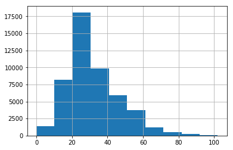
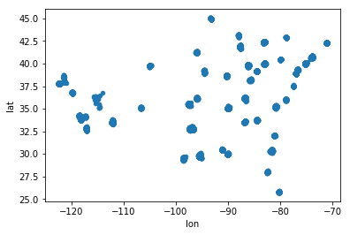
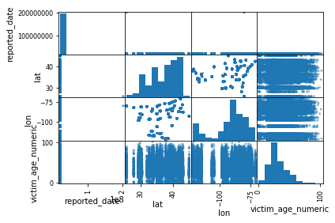
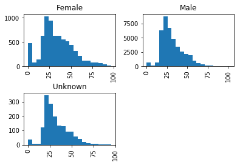
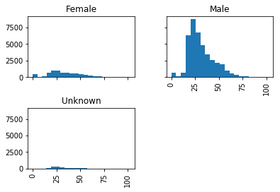
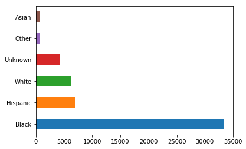

---
redirect_from:
  - "getting-started/pandas"
interact_link: content/getting_started/pandas.ipynb
title: 'pandas 101'
prev_page:
  url: /getting_started/python
  title: 'Python 101'
next_page:
  url: /placeholder
  title: 'Collecting texts'
comment: "***PROGRAMMATICALLY GENERATED, DO NOT EDIT. SEE ORIGINAL FILES IN /content***"
---

## pandas


This section provides a brief introduction to pandas. The pandas library is a key component for doing data science in Python for a couple of reasons. Most importantly, it provides two data types, series and data frame, that allow you to store and manipulate data in a way that is useful for analysis. Second, it is incredibly useful for importing and exporting data in a wide variety of formats. Finally, it makes descriptive analysis, including both summary statistics and visualizations. This section provides an introduction to the main capabilities of pandas relevant to data analysis. 

Most of the things that you will want to do it Python require importing libraries. convention, pandas is imported as `pd`. Additionally, we enable the ability for pandas graphics to be displayed within the notebook with `%matplotlib inline`. 


{:.input_area}
```python
%matplotlib inline

import pandas as pd
```


### Reading data

In the summer of 2017, the Washington Post produced a [report](https://www.washingtonpost.com/graphics/2018/investigations/unsolved-homicide-database/) on murder clearance rates by cities. The also released the [data](https://github.com/washingtonpost/data-homicides) they collected on Github as a csv file. We can create a new dataframe, called `df`, using the [pandas](https://pandas.pydata.org/pandas-docs/stable/generated/pandas.read_csv.html) `read_csv` method.  


{:.input_area}
```python
df = pd.read_csv('homicide.csv')
```


By default, `read_csv` assumes a comma separator, but this could be customized by adding the  `sep=` parameter. So a pipe-delimited version of the file could be read with:

~~~python
df = pd.read_csv('data/homicide.psv', sep='|')
~~~

Additionally, read_csv can access file directly from the web.

```python
csv_url = 'https://raw.githubusercontent.com/washingtonpost/data-homicides/master/homicide-data.csv'

df = pd.read_csv(csv_url)
```

Pandas has a suite of methods for importing a variety of file formats, discussed in the `Bonus_File_Reading` section.

#### Learning about your dataframe

After loading a dataframe, best practice is to get a sense of the data with the `head`, `info` and `describe` methods. `head` shows the first five rows of the dataframe.


{:.input_area}
```python
df.head()
```


<div markdown="0" class="output output_html">
<div>
<style scoped>
    .dataframe tbody tr th:only-of-type {
        vertical-align: middle;
    }

    .dataframe tbody tr th {
        vertical-align: top;
    }

    .dataframe thead th {
        text-align: right;
    }
</style>
<table border="1" class="dataframe">
  <thead>
    <tr style="text-align: right;">
      <th></th>
      <th>uid</th>
      <th>reported_date</th>
      <th>victim_last</th>
      <th>victim_first</th>
      <th>victim_race</th>
      <th>victim_age</th>
      <th>victim_sex</th>
      <th>city</th>
      <th>state</th>
      <th>lat</th>
      <th>lon</th>
      <th>disposition</th>
    </tr>
  </thead>
  <tbody>
    <tr>
      <th>0</th>
      <td>Alb-000001</td>
      <td>20100504</td>
      <td>GARCIA</td>
      <td>JUAN</td>
      <td>Hispanic</td>
      <td>78</td>
      <td>Male</td>
      <td>Albuquerque</td>
      <td>NM</td>
      <td>35.095788</td>
      <td>-106.538555</td>
      <td>Closed without arrest</td>
    </tr>
    <tr>
      <th>1</th>
      <td>Alb-000002</td>
      <td>20100216</td>
      <td>MONTOYA</td>
      <td>CAMERON</td>
      <td>Hispanic</td>
      <td>17</td>
      <td>Male</td>
      <td>Albuquerque</td>
      <td>NM</td>
      <td>35.056810</td>
      <td>-106.715321</td>
      <td>Closed by arrest</td>
    </tr>
    <tr>
      <th>2</th>
      <td>Alb-000003</td>
      <td>20100601</td>
      <td>SATTERFIELD</td>
      <td>VIVIANA</td>
      <td>White</td>
      <td>15</td>
      <td>Female</td>
      <td>Albuquerque</td>
      <td>NM</td>
      <td>35.086092</td>
      <td>-106.695568</td>
      <td>Closed without arrest</td>
    </tr>
    <tr>
      <th>3</th>
      <td>Alb-000004</td>
      <td>20100101</td>
      <td>MENDIOLA</td>
      <td>CARLOS</td>
      <td>Hispanic</td>
      <td>32</td>
      <td>Male</td>
      <td>Albuquerque</td>
      <td>NM</td>
      <td>35.078493</td>
      <td>-106.556094</td>
      <td>Closed by arrest</td>
    </tr>
    <tr>
      <th>4</th>
      <td>Alb-000005</td>
      <td>20100102</td>
      <td>MULA</td>
      <td>VIVIAN</td>
      <td>White</td>
      <td>72</td>
      <td>Female</td>
      <td>Albuquerque</td>
      <td>NM</td>
      <td>35.130357</td>
      <td>-106.580986</td>
      <td>Closed without arrest</td>
    </tr>
  </tbody>
</table>
</div>
</div>


In addition to the data in the csv file, an index has been created to identifiy each row. By default, this is an interger starting with 0. 

If the dataset is wide, middle columns will not be displayed. Also, if text fields are long, only the first few characters will be shown. These can both be adjusted using pandas [display settings](https://pandas.pydata.org/pandas-docs/stable/options.html). 

`info` can be used to explore the data types and the number of non-missing cases for each variable.


{:.input_area}
```python
df.info()
```


{:.output .output_stream}
```
<class 'pandas.core.frame.DataFrame'>
RangeIndex: 52179 entries, 0 to 52178
Data columns (total 12 columns):
uid              52179 non-null object
reported_date    52179 non-null int64
victim_last      52179 non-null object
victim_first     52179 non-null object
victim_race      52179 non-null object
victim_age       52179 non-null object
victim_sex       52179 non-null object
city             52179 non-null object
state            52179 non-null object
lat              52119 non-null float64
lon              52119 non-null float64
disposition      52179 non-null object
dtypes: float64(2), int64(1), object(9)
memory usage: 4.8+ MB

```

`describe` provides summary statistics for all the numeric variables. 


{:.input_area}
```python
df.describe()
```


<div markdown="0" class="output output_html">
<div>
<style scoped>
    .dataframe tbody tr th:only-of-type {
        vertical-align: middle;
    }

    .dataframe tbody tr th {
        vertical-align: top;
    }

    .dataframe thead th {
        text-align: right;
    }
</style>
<table border="1" class="dataframe">
  <thead>
    <tr style="text-align: right;">
      <th></th>
      <th>reported_date</th>
      <th>lat</th>
      <th>lon</th>
    </tr>
  </thead>
  <tbody>
    <tr>
      <th>count</th>
      <td>5.217900e+04</td>
      <td>52119.000000</td>
      <td>52119.000000</td>
    </tr>
    <tr>
      <th>mean</th>
      <td>2.013090e+07</td>
      <td>37.026786</td>
      <td>-91.471094</td>
    </tr>
    <tr>
      <th>std</th>
      <td>1.123420e+06</td>
      <td>4.348647</td>
      <td>13.746378</td>
    </tr>
    <tr>
      <th>min</th>
      <td>2.007010e+07</td>
      <td>25.725214</td>
      <td>-122.507779</td>
    </tr>
    <tr>
      <th>25%</th>
      <td>2.010032e+07</td>
      <td>33.765203</td>
      <td>-95.997198</td>
    </tr>
    <tr>
      <th>50%</th>
      <td>2.012122e+07</td>
      <td>38.524973</td>
      <td>-87.710286</td>
    </tr>
    <tr>
      <th>75%</th>
      <td>2.015091e+07</td>
      <td>40.027627</td>
      <td>-81.755909</td>
    </tr>
    <tr>
      <th>max</th>
      <td>2.015111e+08</td>
      <td>45.051190</td>
      <td>-71.011519</td>
    </tr>
  </tbody>
</table>
</div>
</div>


The column headers can be extracted using `keys`.


{:.input_area}
```python
df.keys()
```


{:.output .output_data_text}
```
Index(['uid', 'reported_date', 'victim_last', 'victim_first', 'victim_race',
       'victim_age', 'victim_sex', 'city', 'state', 'lat', 'lon',
       'disposition'],
      dtype='object')
```


If you wanted to look at the bottom of the dataframe, you can use `tail`. Both `head` and `tail` allow you to change the number of rows displayed from the default five.


{:.input_area}
```python
df.tail(3)
```


<div markdown="0" class="output output_html">
<div>
<style scoped>
    .dataframe tbody tr th:only-of-type {
        vertical-align: middle;
    }

    .dataframe tbody tr th {
        vertical-align: top;
    }

    .dataframe thead th {
        text-align: right;
    }
</style>
<table border="1" class="dataframe">
  <thead>
    <tr style="text-align: right;">
      <th></th>
      <th>uid</th>
      <th>reported_date</th>
      <th>victim_last</th>
      <th>victim_first</th>
      <th>victim_race</th>
      <th>victim_age</th>
      <th>victim_sex</th>
      <th>city</th>
      <th>state</th>
      <th>lat</th>
      <th>lon</th>
      <th>disposition</th>
    </tr>
  </thead>
  <tbody>
    <tr>
      <th>52176</th>
      <td>Was-001382</td>
      <td>20161114</td>
      <td>WASHINGTON</td>
      <td>WILLIE</td>
      <td>Black</td>
      <td>23</td>
      <td>Male</td>
      <td>Washington</td>
      <td>DC</td>
      <td>38.828025</td>
      <td>-77.002511</td>
      <td>Open/No arrest</td>
    </tr>
    <tr>
      <th>52177</th>
      <td>Was-001383</td>
      <td>20161130</td>
      <td>BARNES</td>
      <td>MARCUS</td>
      <td>Black</td>
      <td>24</td>
      <td>Male</td>
      <td>Washington</td>
      <td>DC</td>
      <td>38.820476</td>
      <td>-77.008640</td>
      <td>Open/No arrest</td>
    </tr>
    <tr>
      <th>52178</th>
      <td>Was-001384</td>
      <td>20160901</td>
      <td>JACKSON</td>
      <td>KEVIN</td>
      <td>Black</td>
      <td>17</td>
      <td>Male</td>
      <td>Washington</td>
      <td>DC</td>
      <td>38.866689</td>
      <td>-76.982409</td>
      <td>Closed by arrest</td>
    </tr>
  </tbody>
</table>
</div>
</div>


<div class="alert alert-info">
<h3> Your turn</h3>
<p> Display the first four rows of the dataframe <code>df</code>.  
</div>

### Working with variables


We can get some descriptive statistics on the variable using `describe`. The dataframe can be subset to just this series by placing the variable name in brackets. 


{:.input_area}
```python
df['victim_race'].describe()
```


{:.output .output_data_text}
```
count     52179
unique        6
top       Black
freq      33361
Name: victim_race, dtype: object
```


In the 52,179 cases, there are six different values for `victim_race.` The most common of these is `Black` which occurs with a frquency of 33,361.

The `value_counts` method reports frequncies for all values in descending order.


{:.input_area}
```python
df['victim_race'].value_counts()
```


{:.output .output_data_text}
```
Black       33361
Hispanic     6901
White        6333
Unknown      4199
Other         700
Asian         685
Name: victim_race, dtype: int64
```


For numeric variables, `describe` reports information about the distribution of the variable.


{:.input_area}
```python
df['lat'].describe()
```


{:.output .output_data_text}
```
count    52119.000000
mean        37.026786
std          4.348647
min         25.725214
25%         33.765203
50%         38.524973
75%         40.027627
max         45.051190
Name: lat, dtype: float64
```


Applied to the entire dataframe, `describe` reports the distribution of all of the numeric variable.


{:.input_area}
```python
df.describe()
```


<div markdown="0" class="output output_html">
<div>
<style scoped>
    .dataframe tbody tr th:only-of-type {
        vertical-align: middle;
    }

    .dataframe tbody tr th {
        vertical-align: top;
    }

    .dataframe thead th {
        text-align: right;
    }
</style>
<table border="1" class="dataframe">
  <thead>
    <tr style="text-align: right;">
      <th></th>
      <th>reported_date</th>
      <th>lat</th>
      <th>lon</th>
    </tr>
  </thead>
  <tbody>
    <tr>
      <th>count</th>
      <td>5.217900e+04</td>
      <td>52119.000000</td>
      <td>52119.000000</td>
    </tr>
    <tr>
      <th>mean</th>
      <td>2.013090e+07</td>
      <td>37.026786</td>
      <td>-91.471094</td>
    </tr>
    <tr>
      <th>std</th>
      <td>1.123420e+06</td>
      <td>4.348647</td>
      <td>13.746378</td>
    </tr>
    <tr>
      <th>min</th>
      <td>2.007010e+07</td>
      <td>25.725214</td>
      <td>-122.507779</td>
    </tr>
    <tr>
      <th>25%</th>
      <td>2.010032e+07</td>
      <td>33.765203</td>
      <td>-95.997198</td>
    </tr>
    <tr>
      <th>50%</th>
      <td>2.012122e+07</td>
      <td>38.524973</td>
      <td>-87.710286</td>
    </tr>
    <tr>
      <th>75%</th>
      <td>2.015091e+07</td>
      <td>40.027627</td>
      <td>-81.755909</td>
    </tr>
    <tr>
      <th>max</th>
      <td>2.015111e+08</td>
      <td>45.051190</td>
      <td>-71.011519</td>
    </tr>
  </tbody>
</table>
</div>
</div>


Missing from the list is `victim_age`. `read_csv` is really good about recognizing data types, so there must be some cases with non-numeric values. 


{:.input_area}
```python
df['victim_age'].describe()
```


{:.output .output_data_text}
```
count       52179
unique        102
top       Unknown
freq         2999
Name: victim_age, dtype: object
```


There are 52,179 cases, including 102 unique values. The most frequent of these in "Unknown". 

We can extract all of the values using `values`. Since the result is quite long, pandas will only display the head and tail.


{:.input_area}
```python
df['victim_age'].values
```


{:.output .output_data_text}
```
array(['78', '17', '15', ..., '23', '24', '17'], dtype=object)
```


This is not super useful by itself, but it can be stored as a list-like object for subsquent analysis


{:.input_area}
```python
age_values = df['victim_age'].values

print(len(age_values))
print(age_values[:3])
```


{:.output .output_stream}
```
52179
['78' '17' '15']

```

Since the ages are printed with single quotation marks around them, we know that Python considers them strings, and not numbers. We can confirm this.


{:.input_area}
```python
first_age = age_values[0]
type(first_age)
```


{:.output .output_data_text}
```
str
```


<div class="alert alert-info">
<h3> Your turn</h3>
<p> Explore the <code>disposition</code> columns in the dataframe.  
</div>

<div class="alert alert-info">
<h3> Your turn</h3>
<p> A well-known data set is the list of titanic passengers. A version can be found in the data folder called, "titanic.csv". Open the file as a new dataframe <code>titanic_df</code>. How many cases? How many columns? What can you find out about the data?

</div>


#### Conversions


We can create a new variable, `victim_age_numeric` using the pandas `to_numeric` method. A `coerce` value for the `errors` parameter results in a missing value ("NaN") for instances where a non-numeric string is encountered. In this case, it will be for the "Unknown" cases. Excluding the `errors` option would result in a error for variables like `victim_age` that contain a mix of strings and numbers.


{:.input_area}
```python
df['victim_age_numeric'] = pd.to_numeric(df['victim_age'], errors='coerce')
```


`describe` on the new variable shows we are down to 49,180 cases, with a median victim age of 28.


{:.input_area}
```python
df['victim_age_numeric'].describe()
```


{:.output .output_data_text}
```
count    49180.000000
mean        31.801220
std         14.418692
min          0.000000
25%         22.000000
50%         28.000000
75%         40.000000
max        102.000000
Name: victim_age_numeric, dtype: float64
```


We can also display the contents of the new variable directly, or at least the top and bottom 30 values.


{:.input_area}
```python
df['victim_age_numeric']
```


{:.output .output_data_text}
```
0        78.0
1        17.0
2        15.0
3        32.0
4        72.0
5        91.0
6        52.0
7        52.0
8        56.0
9        43.0
10       20.0
11        NaN
12       46.0
13       16.0
14       54.0
15       43.0
16       52.0
17       52.0
18       22.0
19       49.0
20       15.0
21       25.0
22       20.0
23       47.0
24       88.0
25       27.0
26       36.0
27       47.0
28        1.0
29       58.0
         ... 
52149    46.0
52150    24.0
52151    35.0
52152    31.0
52153    18.0
52154    40.0
52155    37.0
52156    26.0
52157     3.0
52158    30.0
52159    25.0
52160    19.0
52161    26.0
52162    25.0
52163    27.0
52164    22.0
52165    44.0
52166    25.0
52167    38.0
52168    22.0
52169    22.0
52170    25.0
52171    35.0
52172    37.0
52173    20.0
52174    29.0
52175    19.0
52176    23.0
52177    24.0
52178    17.0
Name: victim_age_numeric, Length: 52179, dtype: float64
```


<div class="alert alert-info">
<h3> Your turn</h3>
<p> Display seven value from the middle of our new age variable?

</div>


### Plots

pandas also has plotting capabilies, such as histograms (`hist`) and a correlation matrix (`scatter_matrix`).  These are essential tools for understanding the data.


{:.input_area}
```python
df['victim_age_numeric'].hist()
```


{:.output .output_data_text}
```
<matplotlib.axes._subplots.AxesSubplot at 0x11ad6f630>
```


{:.output .output_png}



By default, plots in a notebook will include something like `<matplotlib.axes._subplots.AxesSubplot at 0x11f4a7a90>` above the figure. This is annoying.

Plot of individual variables, or series in pandas terminology, are attributes of the data type. That is, you start wit the thing you want plotted, in this case `df['victim_age_numeric']`, and append what you want to do, such as `.hist()`. 


A second type of plots, such as scatter plots, are methods of the dataframe. 


{:.input_area}
```python
df.plot.scatter(x='lon', y='lat')
```


{:.output .output_data_text}
```
<matplotlib.axes._subplots.AxesSubplot at 0x11b5cd470>
```


{:.output .output_png}



You could look at the other dataframe plotting methods on the helpful [pandas visualizations page](https://pandas.pydata.org/pandas-docs/stable/visualization.html). Alternatively, typing tab after `df.plot.` also reveals your options.

<p>


Want to know about `hexbin`? Again, the help page on the web is useful, but appending a question mark to the end of the command will bring up the documentation. 


```df.plot.hexbin?```


A third group of plots are part of the pandas plotting library. In these cases, the thing you want plotted is the first, or only, parameter passed, as is the case with the correlation matrix. 


{:.input_area}
```python
pd.plotting.scatter_matrix(df)
```


{:.output .output_data_text}
```
array([[<matplotlib.axes._subplots.AxesSubplot object at 0x11e5f7b70>,
        <matplotlib.axes._subplots.AxesSubplot object at 0x11e6216d8>,
        <matplotlib.axes._subplots.AxesSubplot object at 0x11eecfd68>,
        <matplotlib.axes._subplots.AxesSubplot object at 0x11b6d3438>],
       [<matplotlib.axes._subplots.AxesSubplot object at 0x11b6f9ac8>,
        <matplotlib.axes._subplots.AxesSubplot object at 0x11b6f9b00>,
        <matplotlib.axes._subplots.AxesSubplot object at 0x11b737828>,
        <matplotlib.axes._subplots.AxesSubplot object at 0x11b75feb8>],
       [<matplotlib.axes._subplots.AxesSubplot object at 0x11b813588>,
        <matplotlib.axes._subplots.AxesSubplot object at 0x11f456c18>,
        <matplotlib.axes._subplots.AxesSubplot object at 0x11f48a2e8>,
        <matplotlib.axes._subplots.AxesSubplot object at 0x11f4b0978>],
       [<matplotlib.axes._subplots.AxesSubplot object at 0x11f4e1048>,
        <matplotlib.axes._subplots.AxesSubplot object at 0x11f5086d8>,
        <matplotlib.axes._subplots.AxesSubplot object at 0x11f532d68>,
        <matplotlib.axes._subplots.AxesSubplot object at 0x11f562438>]],
      dtype=object)
```


{:.output .output_png}



You can also create subplots using the `by` option. Note that `by` accepts a series, or dataframe column, rather than a column name. 


{:.input_area}
```python
df['victim_age_numeric'].hist(by   = df['victim_sex'], 
                              bins = 20)
```


{:.output .output_data_text}
```
array([[<matplotlib.axes._subplots.AxesSubplot object at 0x11f86a668>,
        <matplotlib.axes._subplots.AxesSubplot object at 0x11f3862b0>],
       [<matplotlib.axes._subplots.AxesSubplot object at 0x11f3a9860>,
        <matplotlib.axes._subplots.AxesSubplot object at 0x11e8c3ef0>]],
      dtype=object)
```


{:.output .output_png}



By default, `by` produces separate x and y scales for each subgraph. This is why it appears to be a relatively large number of deaths of very young females. The numbers between men and women at this age are comparable, but the very large number of male deaths in their 20s results in very different xscales for the graphs. This option can be changed with the `sharex` or `sharey` option. 


{:.input_area}
```python
df['victim_age_numeric'].hist(by     = df['victim_sex'], 
                              bins   = 20,
                              sharex = True,
                              sharey = True)
```


{:.output .output_data_text}
```
array([[<matplotlib.axes._subplots.AxesSubplot object at 0x11e8760b8>,
        <matplotlib.axes._subplots.AxesSubplot object at 0x12057a940>],
       [<matplotlib.axes._subplots.AxesSubplot object at 0x11e735d30>,
        <matplotlib.axes._subplots.AxesSubplot object at 0x11e767160>]],
      dtype=object)
```


{:.output .output_png}



Finally, the results of value counts of a variable can also be plotted.


{:.input_area}
```python
df['victim_race'].value_counts().plot(kind = 'barh')
```


{:.output .output_data_text}
```
<matplotlib.axes._subplots.AxesSubplot at 0x11f1748d0>
```


{:.output .output_png}



#### Other descriptives

Pandas also has a method for producing crosstabs. 


{:.input_area}
```python
pd.crosstab(df['victim_race'], df['disposition'])
```


<div markdown="0" class="output output_html">
<div>
<style scoped>
    .dataframe tbody tr th:only-of-type {
        vertical-align: middle;
    }

    .dataframe tbody tr th {
        vertical-align: top;
    }

    .dataframe thead th {
        text-align: right;
    }
</style>
<table border="1" class="dataframe">
  <thead>
    <tr style="text-align: right;">
      <th>disposition</th>
      <th>Closed by arrest</th>
      <th>Closed without arrest</th>
      <th>Open/No arrest</th>
    </tr>
    <tr>
      <th>victim_race</th>
      <th></th>
      <th></th>
      <th></th>
    </tr>
  </thead>
  <tbody>
    <tr>
      <th>Asian</th>
      <td>410</td>
      <td>72</td>
      <td>203</td>
    </tr>
    <tr>
      <th>Black</th>
      <td>15462</td>
      <td>1496</td>
      <td>16403</td>
    </tr>
    <tr>
      <th>Hispanic</th>
      <td>3332</td>
      <td>401</td>
      <td>3168</td>
    </tr>
    <tr>
      <th>Other</th>
      <td>366</td>
      <td>30</td>
      <td>304</td>
    </tr>
    <tr>
      <th>Unknown</th>
      <td>2145</td>
      <td>320</td>
      <td>1734</td>
    </tr>
    <tr>
      <th>White</th>
      <td>3959</td>
      <td>603</td>
      <td>1771</td>
    </tr>
  </tbody>
</table>
</div>
</div>


Note that since this is a pandas method, and not one of a specific dataframe, you need to be explicit about which datatframe each variable is coming from. That is why the first parameter is not `'victim_race'` but `df['victim_race']`. 

`normalize` can be used to display percentages instead of frequencies. A value of `index` normalized by row, `columns` by column, and `all` by all values.


{:.input_area}
```python
pd.crosstab(df['victim_race'], df['disposition'], normalize='index')
```


<div markdown="0" class="output output_html">
<div>
<style scoped>
    .dataframe tbody tr th:only-of-type {
        vertical-align: middle;
    }

    .dataframe tbody tr th {
        vertical-align: top;
    }

    .dataframe thead th {
        text-align: right;
    }
</style>
<table border="1" class="dataframe">
  <thead>
    <tr style="text-align: right;">
      <th>disposition</th>
      <th>Closed by arrest</th>
      <th>Closed without arrest</th>
      <th>Open/No arrest</th>
    </tr>
    <tr>
      <th>victim_race</th>
      <th></th>
      <th></th>
      <th></th>
    </tr>
  </thead>
  <tbody>
    <tr>
      <th>Asian</th>
      <td>0.598540</td>
      <td>0.105109</td>
      <td>0.296350</td>
    </tr>
    <tr>
      <th>Black</th>
      <td>0.463475</td>
      <td>0.044843</td>
      <td>0.491682</td>
    </tr>
    <tr>
      <th>Hispanic</th>
      <td>0.482829</td>
      <td>0.058108</td>
      <td>0.459064</td>
    </tr>
    <tr>
      <th>Other</th>
      <td>0.522857</td>
      <td>0.042857</td>
      <td>0.434286</td>
    </tr>
    <tr>
      <th>Unknown</th>
      <td>0.510836</td>
      <td>0.076209</td>
      <td>0.412955</td>
    </tr>
    <tr>
      <th>White</th>
      <td>0.625138</td>
      <td>0.095216</td>
      <td>0.279646</td>
    </tr>
  </tbody>
</table>
</div>
</div>


Since this returns a dataframe, it can be saved or plotted.


{:.input_area}
```python
cross_tab = pd.crosstab(df['victim_race'], df['disposition'], normalize='index')

cross_tab
```


<div markdown="0" class="output output_html">
<div>
<style scoped>
    .dataframe tbody tr th:only-of-type {
        vertical-align: middle;
    }

    .dataframe tbody tr th {
        vertical-align: top;
    }

    .dataframe thead th {
        text-align: right;
    }
</style>
<table border="1" class="dataframe">
  <thead>
    <tr style="text-align: right;">
      <th>disposition</th>
      <th>Closed by arrest</th>
      <th>Closed without arrest</th>
      <th>Open/No arrest</th>
    </tr>
    <tr>
      <th>victim_race</th>
      <th></th>
      <th></th>
      <th></th>
    </tr>
  </thead>
  <tbody>
    <tr>
      <th>Asian</th>
      <td>0.598540</td>
      <td>0.105109</td>
      <td>0.296350</td>
    </tr>
    <tr>
      <th>Black</th>
      <td>0.463475</td>
      <td>0.044843</td>
      <td>0.491682</td>
    </tr>
    <tr>
      <th>Hispanic</th>
      <td>0.482829</td>
      <td>0.058108</td>
      <td>0.459064</td>
    </tr>
    <tr>
      <th>Other</th>
      <td>0.522857</td>
      <td>0.042857</td>
      <td>0.434286</td>
    </tr>
    <tr>
      <th>Unknown</th>
      <td>0.510836</td>
      <td>0.076209</td>
      <td>0.412955</td>
    </tr>
    <tr>
      <th>White</th>
      <td>0.625138</td>
      <td>0.095216</td>
      <td>0.279646</td>
    </tr>
  </tbody>
</table>
</div>
</div>


{:.input_area}
```python
cross_tab.to_csv('data/crosstab.csv')
```


<div class="alert alert-info">
<h3> Your turn</h3>
<p> In your titanic dataframe, run a crosstab between sex and survived. Anything interesting?

</div>


In order to highlight a meaningful characteristics of the data, you can sort before plotting. 


{:.input_area}
```python
cross_tab.sort_values(by='Closed by arrest')
```


{:.input_area}
```python
cross_tab.sort_values(by='Closed by arrest').plot(kind   = 'barh',
                                                  title  = 'Disposition by race')
```


#### Subsets

Similar to a list, a dataframe or series can be sliced to subset the data being shown. For example, `df[:2]` will return the first two rows of the dataframe. (This is identical to `df.head(2)`.)


{:.input_area}
```python
df[:2]
```


{:.input_area}
```python
df.head(2)
```


This also works for specific columns.


{:.input_area}
```python
df['reported_date'][:3]
```


#### Dates

A new variable can be created from `reported_date` that pandas understands is a date variable using the `to_datetime` method. The format is `%Y%m%d` because the original date is in the "YYYMMDD" format, and `coerce` places missing values where the data can be translated, rather than stopping the variable creation completely. 


{:.input_area}
```python
df['date'] = pd.to_datetime(df['reported_date'], 
                            format='%Y%m%d', 
                            errors='coerce')
```


{:.input_area}
```python
df['date'][:3]
```


From the new series, we can extract specific elements, such as the year.


{:.input_area}
```python
df['year'] = df['date'].dt.year
```


As before, `value_counts` and plots can give some sense of the distribution of the values.


{:.input_area}
```python
df['year'].value_counts()
```


Value counts returns a pandas series with an index equal to the original values, in the case the year, and the series values based on the frequency. Since years have an order, it makes sense to sort by the index before plotting them.


{:.input_area}
```python
df['year'].value_counts().sort_index(ascending = False).plot(kind='barh')
```


`crosstab` can also group based on more than one variable for the x or y axis. In that case, you pass a list rather than a single variable or series. To make this clearer, you can create the lists before creating the crosstab.


{:.input_area}
```python
y_vars = [df['state'], df['city']]
x_vars = df['year']

pd.crosstab(y_vars, x_vars)
```


Crosstab returns a dataframe with the column and index names from the values in the original dataset. Since a list was passed, the datatframe has a `MultiIndex`. The can be useful for cases where you have nested data, like cities with states or annual data on multiple countries.


{:.input_area}
```python
pd.crosstab(y_vars, x_vars).index.names
```


By default, the index is a series that starts with 0. If your data has unique identifiers, however, it is helpful to use that as the index, especially if you intend on merging your data with other data sources. In this dataframe, each row has a unique value for `uid`.


{:.input_area}
```python
df.set_index('uid', inplace=True)
```


{:.input_area}
```python
df[:5]
```


<div class="alert alert-info">
<h3> Your turn</h3>
<p> In your Titanic dataframe, set the index to the <code>PassengerId</code> column. Confirm that it did want you wanted it to do.

</div>


#### Subseting

You can view a subset of a dataframe based on the value of a column. 

Let's say that you wanted to look at the cases where the victim's first name was "Juan". You could create a new series which is either `True` or `False` for each case.


{:.input_area}
```python
df['victim_first'] == 'JUAN'
```


You could store this new true/false series. If you placed this in brackets after the name of the dataframe, pandas would display only the rows with a True value.


{:.input_area}
```python
is_juan = df['victim_first'] == 'JUAN'
df[is_juan]
```


More commonly, the two statements are combined.


{:.input_area}
```python
df[df['victim_first'] == 'JUAN']
```


With this method of subsetting, pandas doesn't return a new dataframe, but rather is just hiding some of the rows. So if you want to create a new dataframe based on this subset, you need to append `copy()` to the end. 


{:.input_area}
```python
new_df = df[df['victim_first'] == 'JUAN'].copy()
```


{:.input_area}
```python
new_df.head()
```


As this selection method returns a dataframe, it can be stored. The following creates two dataframes, one with just the 2016 and one with just the 2017 cases.


{:.input_area}
```python
df_2017 = df[df['year'] == 2017].copy()
df_2016 = df[df['year'] == 2016].copy()


df_2017['year'].value_counts()
```


{:.input_area}
```python
df_2016['year'].value_counts()
```


`value_counts` confirms that the correct cases were grabbed.

Alternatively you may want to limit your dataset by column. In this case, you create a list of the columns you want. This list is also placed in brackets after the dataframe name.

<div class="alert alert-info">
<h3> Your turn</h3>
<p> Create a new dataframe with just the female passengers. Check your work.

</div>


#### More subsets


{:.input_area}
```python
columns_to_keep = ['victim_last', 'victim_first', 'victim_race', 'victim_age', 'victim_sex']
```


{:.input_area}
```python
df[columns_to_keep]
```


As before, you can you use `copy` to create a new dataset.


{:.input_area}
```python
victim_df = df[columns_to_keep].copy()
```


{:.input_area}
```python
victim_df.head()
```


As with the row selection, you don't need to store the column names in a list first. By convention, these two steps are combined. However, combining the steps does create an awkward pair of double brackets.


{:.input_area}
```python
place_df = df[['city', 'state', 'lat', 'lon']].copy()
```


{:.input_area}
```python
place_df.head()
```


#### Merging

There are several different ways to combine datasets. The most straightforward is to merge two different datasets who share a key in common. To merge `place_df` with  `victim_df`, for example, you can use the datframe `merge` method. 


{:.input_area}
```python
merged_df = place_df.merge(victim_df, left_index=True, right_index=True)

merged_df.head()
```


### Stacking dataframes


{:.input_area}
```python
df_2016 = df[df['year'] == 2016]
len(df_2016)
```


{:.input_area}
```python
recent_df = pd.concat([df_2017, df_2016])
```


{:.input_area}
```python
len(recent_df)
```


{:.input_area}
```python
pd.concat([victim_df, place_df], axis = 1)
```


{:.input_area}
```python
df['birth_year'] = df['year'] - df['victim_age_numeric']
```


{:.input_area}
```python
df['birth_year'].describe()
```


{:.input_area}
```python
df['minor'] = df['victim_age'] <= 18
```


{:.input_area}
```python
df['minor'][:10]
```


{:.input_area}
```python
df['minor'].mean()
```


<div class="alert alert-info">
<h3> Your turn</h3>
<p> Create a new variable in your Titanic dataframe which marks the people who paid a fare in the top 25% of all fares paid.

</div>


{:.input_area}
```python
'Back to some pandas string manipulation fun.'.title()
```


{:.input_area}
```python
def title_case(text):
    return text.title()
```


{:.input_area}
```python
title_case('JUAN')
```


### The apply magic


{:.input_area}
```python
df['victim_first2'] = df['victim_first'].apply(title_case)
```


{:.input_area}
```python
df['victim_first2'].head(10)
```


{:.input_area}
```python
df[['victim_first', 'victim_first2']].head(10)
```


<div class="alert alert-info">
<h3> Your turn</h3>
<p> Write a function that extracts the last name from the name field on your Titanic dataframe. 
Create a new variable called <code>Family Name</code> to store the results. What is the most common family name?

</div>


Working on more than one column


{:.input_area}
```python
def victim_name(row):
    first_name = row['victim_first']
    last_name  = row['victim_last']
    name       = last_name + ', ' + first_name
    name       = title_case(name)
    return name
```


{:.input_area}
```python
df.apply(victim_name, axis=1)
```


{:.input_area}
```python
df['victim_name'] = df.apply(victim_name, axis=1)
```


{:.input_area}
```python
df.head()
```


<div class="alert alert-info">
<h3> Your turn</h3>
<p> What did we learn today? Can you use any of this on a dataset that already work on?
</div>

### Encodings

Text files may also include special characters, such as 😎 which can be written as `\U0001f60e`


{:.input_area}
```python
print('\U0001f60e')
```


In this case, you might need to set the encoding parameter. With most CSV, files, unfortunately, this is usually a process of trial and error:


{:.input_area}
```python
csv_url = 'https://raw.githubusercontent.com/washingtonpost/data-homicides/master/homicide-data.csv'

df = pd.read_csv(csv_url)
```


{:.input_area}
```python
df = pd.read_csv(csv_url, encoding='iso-8859-1')
```


In this case, the csv file was not encoding in utf-8, but `iso-8859-1`, also know as `latin1`. According to [someone one the intenet](https://w3techs.com/technologies/overview/character_encoding/all), the most frequently used encodings on the web are:

1. UTF-8 (92% of web pages) - Default for Python 3.x
2. ISO-8859-1 (4%) (`encoding = iso-8859-1` or `encoding = latin1`)
3. Windows-1251 (1%) - Used for Cyrillic script (`encoding = windows-1251`)
4. Windows-1252 (<1%) - Old fork of ISO-8859-1 (`encoding = windows-1252`)
3. Shift JIS (<1%) - Japanese characters  (`encoding = shift-jis`)

You might need to Google around for other langauage specific encodings.
